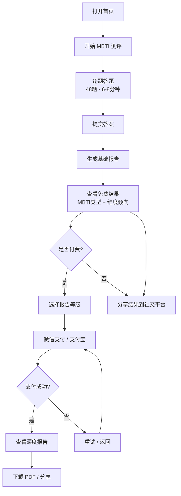

# 职探

**轻量化 MBTI 职业性格测评网页 — 产品需求文档**

| 项目 | 说明 |
|------|------|
| 文档版本 | PRD v3.4 |
| 创建日期 | 2026-07-07 |
| 最后更新 | 2026-07-09 |
| 产品类型 | 0-to-1 轻量级 Web 应用 |
| 文档状态 | 评审稿 |

---

## 目录

- [需求背景](#需求背景)
- [产品目标](#产品目标)
- [用户画像](#用户画像)
- [竞品分析](#竞品分析)
- [测评体系设计](#测评体系设计)
- [量表题库与评分算法规格](#量表题库与评分算法规格)
- [职业匹配数据库](#职业匹配数据库)
- [功能需求](#功能需求)
- [深度报告内容模板](#深度报告内容模板)
- [非功能性需求](#非功能性需求)
- [商业模式](#商业模式)
- [数据指标](#数据指标)
- [风险分析与应对](#风险分析与应对)
- [冷启动运营策略](#冷启动运营策略)
- [隐私与合规](#隐私与合规)
- [迭代规划](#迭代规划)

---

## 需求背景

2026 年中国高校毕业生人数预计突破 1200 万，就业市场竞争持续加剧。与此同时，国内 MBTI 测试用户规模已达 5800 万，18–35 岁年轻群体占比超过七成[^1]。数据表明年轻一代对自我认知和职业规划的需求正在快速增长，MBTI 已成为社交媒体上讨论度最高的性格测评工具。

然而，现有 MBTI 测评产品普遍存在三个核心痛点：

- **使用门槛高**：多数平台要求注册、绑定手机号，部分还需要付费才能查看基础结果，劝退了大量"只是想快速了解一下"的用户。
- **耗时过长或过短**：完整版 MBTI 需要 20–30 分钟，而极简版又因题量太少导致结果不稳定、重测反复摇摆。
- **价格偏高**：专业测评平台单次报告价格普遍在 49–199 元，对学生群体而言门槛过高。

调研数据显示，80% 的用户优先选择免费测试平台，78% 的用户曾遇到测试结果反复摇摆的问题，63% 的用户认为测评报告千篇一律缺乏参考性[^1]。市场需要一款在测评时长和结果可靠性之间取得平衡、价格亲民、体验流畅的 MBTI 职业性格测评产品。

---

## 产品目标

打造一款面向大学生和职场新人的轻量化 MBTI 职业性格测评网页，核心定位是**"八分钟，看见你的职业性格"**。

> **产品原则：** 无需注册、打开即测、基础免费、深度亲民。用较低门槛触达最大用户群，用亲民价格实现商业转化。

具体目标拆解：

- **轻量化体验**：单次测评 6–8 分钟完成，界面简洁清爽，移动端优先。
- **零门槛使用**：无需注册、无需授权个人信息，打开网页即可开始测评。
- **免费基础报告**：MBTI 类型结果和四维度倾向免费查看，最大化用户访问量。
- **亲民付费转化**：深度报告定价 2.99 元，远低于行业均价（49–199 元），极大降低付费决策阻力。
- **社交传播**：结果页支持一键分享至社交平台，利用用户自发传播获取自然流量。

---

## 用户画像

### 核心用户：在校大学生

年龄 18–24 岁，大二至研三阶段，正面临专业方向选择、实习申请或秋招春招。他们对 MBTI 有一定认知（社交媒体高频讨论），愿意花几分钟做一次靠谱的测试但不愿投入 20 分钟以上。典型使用场景：在社交媒体看到朋友分享 MBTI 结果后点进来试试，或者在求职前想快速了解自己的职业性格。

### 延伸用户：职场新人

年龄 22–28 岁，毕业 1–3 年，正在经历第一份工作的适应期或考虑跳槽转行。他们希望借助 MBTI 工具验证自己的职业方向是否合理，或者探索更适合的发展路径。典型使用场景：工作遇到瓶颈时想重新审视自己的性格特质和职业匹配度，或者准备跳槽前想了解自身优势和适合方向。

### 用户核心需求矩阵

| 需求维度 | 在校大学生 | 职场新人 |
|----------|-----------|---------|
| 核心诉求 | 了解性格类型，明确求职方向 | 验证职业选择，探索发展路径 |
| 时间预期 | 6–8 分钟 | 6–8 分钟 |
| 付费意愿 | 低（0–10 元） | 中（5–15 元） |
| 结果期望 | 趣味类型标签 + 职业推荐，可分享 | 专业性格分析 + 发展建议，可参考 |
| 使用频率 | 1–2 次（关键节点触发） | 2–4 次（阶段性复盘） |

---

## 竞品分析

当前市场上的 MBTI 测评产品可分为三类：全球通用平台（如 16Personalities）、中文免费测评网站（如知己 MBTI、简则 MBTI）、以及综合测评机构的内置模块（如北森）。以下选取代表性竞品进行对比。

### 竞品基础信息对比

| 竞品 | 定位 | 测评时长 | 注册要求 | 基础报告 | 深度报告价格 | 核心短板 |
|------|------|---------|---------|---------|-------------|---------|
| 16Personalities | 全球 MBTI 入门平台 | 10–15 分钟 | 无需注册 | 免费（内容丰富） | 付费指南约 $5 | 缺乏本土化职业推荐 |
| 知己 MBTI | 中文 MBTI 头部平台 | 10–30 分钟 | 无需注册 | 免费 | 定制报告约 19–39 元 | 深度报告价格偏高 |
| 简则 MBTI | 中文轻量化 MBTI | 8–10 分钟 | 无需注册 | 免费 | 暂无 | 无深度报告和商业模式 |
| 北森测评 | 企业级人才测评 | 20–60 分钟 | 企业邀请 | 企业付费 | 99–199 元/次 | 面向 B 端，个人用户门槛高 |

### 竞品功能对比矩阵

| 功能维度 | 16Personalities | 知己 MBTI | 简则 MBTI | 北森测评 | **职探（目标）** |
|---------|:---:|:---:|:---:|:---:|:---:|
| 测评时长 | 10–15 分钟 | 10–30 分钟 | 8–10 分钟 | 20–60 分钟 | **6–8 分钟** |
| 题目格式 | 二选一迫选 | 二选一迫选 | 二选一迫选 | 五点量表 | **6 点刻度迫选** |
| 维度面向分析 | 否 | 否 | 否 | 否 | **是（12 子维度）** |
| 认知功能分析 | 否 | 否 | 否 | 否 | **是（八维功能栈）** |
| 深度付费报告 | 有（场景指南） | 有（定制报告） | 无 | 有（企业版） | **有（单一深度报告）** |
| PDF 下载 | 有（Premium） | 有 | 无 | 有 | **有（高阶报告）** |
| AI 个性化解读 | 否 | 否 | 否 | 有（AI 解读） | **规划中（V2.0）** |
| 社交分享 | 有（链接分享） | 有 | 有 | 否 | **有（卡片图分享）** |
| 本土化职业库 | 否（全球视角） | 部分 | 部分 | 是 | **是（国内大典）** |
| 免注册使用 | 是 | 是 | 是 | 否 | **是** |
| 移动端适配 | 是 | 是 | 是 | 否（PC 端） | **是（移动优先）** |
| 压力应对分析 | 否 | 否 | 否 | 部分 | **规划中（V1.5）** |
| 人格恋爱专题 | 否 | 否 | 否 | 否 | **是（三阶段分析）** |

### 竞品结论与差异化机会

现有 MBTI 测评平台普遍存在三个问题：一是**耗时偏长**，主流平台需要 10–30 分钟；二是**深度报告价格偏高**，知己 MBTI 的定制报告 19–39 元仍超出学生群体心理预期；三是**缺乏职业落地**，多数平台给出 MBTI 类型描述后缺少具体的职业匹配和发展建议。同时，极简版平台（如简则）题量太少导致结果不稳定，重测摇摆率高。

职探的差异化定位：在保持"免注册 + 轻量化"体验的同时，用 48 题（6–8 分钟）在测评时长和结果可靠性之间取得平衡，采用 6 点刻度迫选法提升测评精度（相比传统二选一迫选能捕捉倾向强度差异），并引入维度面向分析、认知功能理论、人格恋爱专题增加报告深度，以远低于行业均价的单一深度报告实现商业闭环。功能对比矩阵显示，目前没有任何一款产品同时满足"6–8 分钟 + 6 点刻度迫选 + 维度面向分析 + 认知功能分析 + 人格恋爱专题 + 低价付费 + 本土化职业库 + 移动优先"八项条件，这正是职探的竞争空间。

---

## 测评体系设计

产品聚焦 MBTI 单一量表，采用 48 题增强版设计：每个维度拆分为 3 个面向（facet），每个面向 4 道题，使测评结果既有维度层面的类型判定，也有面向级别的细微差异分析。在此基础上通过认知功能理论扩展报告深度，使单一量表也能产出多维度的职业性格分析。

### 核心量表

| 量表 | 理论基础 | 题数 | 测评时长 | 核心产出 | 信度指标 |
|------|---------|------|---------|---------|---------|
| 职业性格测评 | MBTI 四维度模型 + 维度面向理论 + 荣格认知功能理论 | 48 题 | 6–8 分钟 | MBTI 类型代码 + 四维度倾向 + 12 面向得分 + 认知功能栈 + 职业推荐 | 重测信度 ≥ 0.85 |

> **题目格式：** 采用 6 点刻度迫选法（graded forced-choice）。每题给出两个描述 A 和 B，用户在 6 点渐变刻度上选择最符合自己的位置：位置 1–3 倾向 A 极（强度递减 3/2/1），位置 4–6 倾向 B 极（强度递增 1/2/3）。相比传统二选一迫选（0/1 计分），6 点刻度法能捕捉倾向强度差异，显著提升重测信度和区分度。

### 四维度与面向设计

每个维度拆分为 3 个面向，每个面向 4 道题（含 1 道反向题），共 48 题：

| 维度 | 极性对 | 面向 1 | 面向 2 | 面向 3 | 题数 |
|------|--------|--------|--------|--------|------|
| 能量方向 | E ↔ I | 社交能量（从社交获取/消耗能量） | 注意力焦点（外部世界/内心世界） | 表达方式（先说后想/先想后说） | 12 题 |
| 信息收集 | S ↔ N | 信息焦点（具体细节/整体图景） | 学习偏好（经验导向/理论导向） | 想象倾向（务实/想象） | 12 题 |
| 决策方式 | T ↔ F | 决策依据（逻辑/价值观） | 冲突处理（对事/对人） | 评价标准（客观公正/共情理解） | 12 题 |
| 生活方式 | J ↔ P | 时间管理（计划/弹性） | 任务执行（先完成再优化/边做边调整） | 秩序偏好（结构化/开放式） | 12 题 |

> **设计依据：** MBTI 官方 Step II 将每个维度拆分为 5 个面向（共 144 题），职探选取其中区分度最高的 3 个面向并压缩题量，在保留面向级分析能力的同时控制测评时长。48 题相比标准 MBTI（93 题）压缩至约 1/2，相比极简版（28–32 题）增加了约 50% 的题量。同时采用 6 点刻度迫选法替代传统二选一迫选，每题从 0/1 计分升级为 1–3 分加权计分，在不增加题量的前提下将单维度信息量提升约 3 倍，显著改善结果稳定性和重测一致性。

### 认知功能分析

基于 MBTI 四字母类型，推导荣格八种认知功能的使用排序。认知功能分析为付费报告增加深度，无需用户额外答题：

| 功能 | 缩写 | 含义 |
|------|------|------|
| 外向感觉 | Se | 直接体验当下、关注感官细节 |
| 内向感觉 | Si | 基于过往经验储存和对比信息 |
| 外向直觉 | Ne | 探索可能性、发散联想 |
| 内向直觉 | Ni | 洞察深层模式、预见趋势 |
| 外向思考 | Te | 组织外部世界、系统化决策 |
| 内向思考 | Ti | 内部逻辑分析、精确分类 |
| 外向情感 | Fe | 关注他人情感、维护群体和谐 |
| 内向情感 | Fi | 个人价值观、内在道德准则 |

每个 MBTI 类型对应固定的认知功能栈（主导 > 辅助 > 第三 > 劣势），例如：

| MBTI 类型 | 主导 | 辅助 | 第三 | 劣势 | 典型特征 |
|-----------|------|------|------|------|---------|
| INTJ | Ni | Te | Fi | Se | 战略远见 + 系统执行 |
| ENFP | Ne | Fi | Te | Si | 创意发散 + 价值驱动 |
| ISTJ | Si | Te | Fi | Ne | 经验积累 + 规范执行 |
| ESFJ | Fe | Si | Ne | Ti | 群体关怀 + 传统守护 |

> 完整 16 型认知功能栈以配置表形式存储于后端，前端根据用户 MBTI 类型查表渲染对应分析内容。

---

## 量表题库与评分算法规格

本章为工程团队提供量表开发的详细规格，包含题目格式、计分规则、结果分级标准和匹配算法。

### 题目格式与示例

#### 分位数迫选法（6 点刻度选择）

每道题给出两个描述（A 和 B），用户在两者之间的 6 点刻度上选择最接近自己真实情况的位置。两端为大圆（表示强烈倾向某一极），中间为小圆（表示轻微倾向），从 A 侧到 B 侧颜色渐变。题目按面向分组设计，但展示时随机打乱顺序，避免用户识别维度规律。

**6 点刻度对应分值：**

| 位置 | 视觉表现 | 含义 | 计分 |
|------|---------|------|------|
| 1（最左 · A 极） | 大圆 · A 侧色 | 非常同意 A | A 极 +3 |
| 2 | 中圆 · A 侧色 | 比较同意 A | A 极 +2 |
| 3 | 小圆 · A 侧色 | 稍微同意 A | A 极 +1 |
| 4 | 小圆 · B 侧色 | 稍微同意 B | B 极 +1 |
| 5 | 中圆 · B 侧色 | 比较同意 B | B 极 +2 |
| 6（最右 · B 极） | 大圆 · B 侧色 | 非常同意 B | B 极 +3 |

> 等效转换：以 A 极为负、B 极为正，每题得分为 -3 至 -1（选 A）或 +1 至 +3（选 B），无零分（迫选，不存在完全中立）。

> **示例题 1（E/I · 社交能量面向）**：
> A. 参加完一场热闹的聚会后，我感到精力充沛
> B. 参加完一场热闹的聚会后，我感到需要独处恢复
> ①───②───③───④───⑤───⑥
> （选①③ → E 得分；选④⑥ → I 得分）

> **示例题 2（E/I · 注意力焦点面向）**：
> A. 我更关注外部环境中正在发生的事
> B. 我更关注内心世界的想法和感受

> **示例题 3（S/N · 信息焦点面向）**：
> A. 我更关注具体的事实和可验证的细节
> B. 我更关注事物之间的联系和整体图景

> **示例题 4（S/N · 想象倾向面向 · 反向题）**：
> A. 我更愿意解决眼前的实际问题
> B. 我更愿意探索未来可能发生的事情

> **示例题 5（T/F · 冲突处理面向）**：
> A. 面对分歧时我更关注谁对谁错
> B. 面对分歧时我更关注维护各方关系

> **示例题 6（J/P · 任务执行面向）**：
> A. 我习惯先完成任务再检查和完善
> B. 我习惯边做边调整，喜欢灵活推进

### 评分规则

| 步骤 | 规则 |
|------|------|
| 1. 题目计分 | 每道题根据用户选择的刻度位置赋分。选位置 1–3 得分计入 A 极（3/2/1 分），选位置 4–6 得分计入 B 极（1/2/3 分）。以 E/I 维度为例：A 极 = E，B 极 = I |
| 2. 面向计分 | 每个面向 4 道题，将 4 道题的 A 极得分和 B 极得分分别求和。如社交能量面向中 E 端总分为 9、I 端总分为 3，则该面向归为 E，强度 = (9-3) / 12 = 50% |
| 3. 维度计分 | 每个维度 3 个面向共 12 道题，将所有题目的 A 极总分和 B 极总分分别求和。以 E/I 为例：E 总分 + I 总分 = 12 题 × 平均分（满分 3 × 12 = 36）。如 E 总分 = 24、I 总分 = 12，则维度得分为 E 24:12 |
| 4. 倾向强度 | 倾向百分比 = \|E 总分 - I 总分\| / 36 × 100%。如 E 总分 24、I 总分 12，则 E 倾向 = 12/36 × 100% ≈ 33%，类型判定为 E |
| 5. 类型判定 | 总分较高的一端为该维度的类型字母。四维度字母组合即为 MBTI 类型（如 ENFP） |
| 6. 临界处理 | 若某维度两端总分相等（如 E=18, I=18），标记为 X（如 XNFP），报告中提示"该维度倾向不明显，建议结合实际体验判断" |
| 7. 面向一致性检测 | 同一维度内 3 个面向的判定方向应一致。若 2 个面向指向 E、1 个指向 I，属正常差异；若 3 个面向方向不一致（1E + 1I + 1 临界），标记为"维度内部一致性偏低"，结果仅供参考 |
| 8. 反向题一致性 | 同面向内的反向题若出现矛盾回答（如正向题选位置 1 指向 E，反向题选位置 6 仍指向 E），标记为"作答不一致"，结果仅供参考 |
| 9. 极端作答检测 | 若用户连续 8 题以上选择位置 1 或 6（极端位置），标记为"极端作答模式"，提示用户可能存在刻板选择倾向 |
| 10. 认知功能推导 | 根据四字母类型查认知功能栈配置表，得出主导/辅助/第三/劣势功能排序 |

### 结果分级标准

各维度倾向强度分为三级（基于 12 题 × 满分 3 = 36 分制）：

| 等级 | 倾向百分比 | 含义 | 典型得分分布 |
|------|-----------|------|-------------|
| 明显倾向 | ≥ 50% | 该维度特质显著，是核心性格特征 | 差值 ≥ 18（如 E 27:9） |
| 中等倾向 | 25–49% | 该维度有一定倾向，可作为参考 | 差值 9–17（如 E 22:14） |
| 轻微倾向 | < 25% | 该维度倾向不明显，两极特征均不突出 | 差值 < 9（如 E 19:17） |

### 面向级结果展示

维度内部的面向分析为付费报告独有内容（基础结果页仅展示维度级倾向），展示形式如下：

| 维度 | 面向 | 你的倾向 | 说明 |
|------|------|---------|------|
| E/I | 社交能量 | E（9:3）| 从社交中获取能量，强度 50% |
| E/I | 注意力焦点 | I（3:9）| 更关注内心世界，强度 50% |
| E/I | 表达方式 | E（8:4）| 习惯先表达后整理，强度 33% |

> 面向级分析的价值：同维度内可能存在内部差异（如 E 倾向但注意力焦点偏 I），这种细微差异帮助用户理解"为什么我测出 E 但有时觉得自己很内向"。

### 职业匹配算法

职业推荐基于 MBTI 类型与职业数据库的匹配度计算：

```
匹配度 = (类型直接匹配 × 0.6) + (维度强度匹配 × 0.4)

- 类型直接匹配：用户 MBTI 类型在职业的 mbti_fit 列表中 → 100 分
              相邻类型（仅一个维度不同）在 mbti_fit 中 → 70 分
              其余 → 0 分

- 维度强度匹配：用户四维度倾向百分比向量与职业 mbti_ideal 标准画像的余弦相似度，范围 0–100

最终匹配度 ≥ 75 → 强推荐
最终匹配度 50–74 → 适中推荐
最终匹配度 < 50 → 不推荐（不展示）
```

> 维度强度匹配的作用：同为 ENFP，但 Ne 极强（80%+）和 Ne 中等（40%）的用户，推荐职业的排序会有差异。前者更推荐创意密集型岗位，后者可适当扩展到结构化创意岗位。

---

## 职业匹配数据库

深度报告的核心价值依赖于职业数据库的质量。本章定义数据库的结构、来源和维护机制。

### MBTI 类型配置表

认证卡展示所需的数据以 MBTI 类型配置表形式存储于后端，前端根据用户类型查表渲染：

| 字段名 | 类型 | 说明 | 示例 |
|--------|------|------|------|
| type_code | string | MBTI 四字母类型代码 | ENFP |
| type_name | string | 类型中文名称 | 竞选者 |
| type_slogan | string | 类型标语 | 活力四射的创意家 |
| rarity | float | 人格稀有度（全球统计百分比） | 8.49 |
| rarity_label | string | 稀有度文案 | 超受欢迎人格~ |
| famous_people | array | 同类型名人列表 | ["罗宾·威廉姆斯","蕾哈娜"] |
| best_partners | array | 最佳搭子人格类型 | ["INTJ","INFJ","ENTJ"] |
| romantic_matches | array | 最佳恋爱匹配类型 | ["INTP","ENTP","ENFP"] |
| mascot_url | string | 3D 人偶图片 CDN 地址 | https://cdn.../enfp.webp |
| type_description | text | 类型简述（200-300 字） | ENFP 是充满热情和创造力的… |

> 稀有度数据来源：16Personalities 全球统计 + CPP Inc. 官方分布数据。名人列表需人工筛选具有较高知名度的公众人物，每位类型 2–3 人。

### 数据库字段结构

| 字段名 | 类型 | 说明 | 示例 |
|--------|------|------|------|
| career_id | string | 职业唯一标识 | CAREER_001 |
| career_name | string | 职业名称 | UI/UX 设计师 |
| category | string | 职业大类 | 互联网/产品 |
| mbti_fit | array | 适配 MBTI 类型列表 | ["ENFP","INFP","ENFJ","INFJ"] |
| mbti_ideal | json | 四维度理想倾向画像 | {"E":60,"S":30,"T":40,"J":30} |
| cognitive_fit | array | 适配主导认知功能 | ["Ne","Ni","Fi"] |
| work_style | string | 理想工作环境描述 | 鼓励创意、自主度高、团队协作 |
| skill_required | array | 核心能力要求 | ["创意设计","用户研究","原型工具"] |
| salary_range | string | 薪资参考范围（应届/1-3年） | 应届 8-12K，1-3年 12-20K |
| growth_prospect | string | 发展前景描述 | 需求稳定，AI 工具推动岗位升级 |
| description | text | 职业简介（100-200 字） | 负责产品的交互设计和视觉呈现… |
| match_tags | array | 匹配关键词 | ["创意","审美","用户洞察"] |

### 数据来源与构建方式

| 数据类别 | 来源 | 构建方式 | 更新频率 |
|---------|------|---------|---------|
| 职业基础信息 | 《中华人民共和国职业分类大典（2022 年版）》 | 人工筛选适合大学生/职场新人的职业方向，预计收录 80–120 个职业 | 每年一次 |
| MBTI 适配列表 | MBTI 官方职业适配指南 + 16Personalities 职业推荐 | 每种 MBTI 类型关联 10–15 个适配职业 | 初始构建后稳定 |
| 维度理想画像 | 职业心理学家评估 + 岗位 JD 分析 | 结合职业特性设定四维度的理想倾向分布 | 初始构建后稳定 |
| 认知功能适配 | 荣格认知功能理论 + 职业心理学研究 | 按主导认知功能归类适配职业 | 初始构建后稳定 |
| 薪资数据 | 公开招聘平台（Boss 直聘、拉勾网）公开薪资区间 | 抓取各职业的薪资中位数和分布范围，按城市分级标注 | 每季度更新 |
| 发展前景 | 行业报告 + 公开就业数据 | 人工撰写每个职业的 2-3 句发展前景描述 | 每半年更新 |

### 数据质量保障

- **初始构建阶段**：由产品经理 + 心理学顾问协同构建初始数据库，完成后邀请 3–5 位高校就业指导老师进行交叉审核
- **上线前验证**：选取 30 个典型职业，与已有平台（如 16Personalities、北森）的职业推荐结果进行对比，一致性 ≥ 70% 方可上线
- **持续优化**：根据用户反馈（"这个职业推荐不准"按钮）定期修正数据，每月复盘修正量

---

## 功能需求

### 功能总览表

| # | 模块 | 功能描述 |
|---|------|---------|
| 1 | 首页 | 产品着陆页。顶部展示产品 slogan 和核心卖点（8 分钟、免注册、免费），下方展示 MBTI 职业性格测评入口卡片，包含量表简介、预计时长、已完成人数。底部放置用户评价和使用流程说明。页面需支持移动端自适应，首屏加载时间 ≤ 2 秒。 |
| 2 | 测评流程 | 用户点击"开始测评"进入答题页。顶部显示进度条和题号（如"8/48"），每次展示一道题目、两个描述（A/B）和 6 个刻度选择圆点（从 A 极到 B 极渐变排列）。用户选择刻度位置后自动跳转下一题，支持返回修改。答题过程中数据实时保存至浏览器本地存储，防止意外退出导致进度丢失。全部答完后自动跳转结果页。 |
| 3 | 基础结果页（免费） | 测评完成后即时生成"人格认证卡"。顶部为认证卡头（双色挂签 + 标题 + "已认证"徽章），核心区域展示 MBTI 类型代码（渐变紫色大字）和类型标语，右侧放置 3D 黏土风格人偶插画。下方统计面板展示人格稀有度百分比、相同人格名人、最佳搭子人格类型（标签按钮）。再下展示四维度倾向条、推荐职业方向、分享按钮和付费墙入口。 |
| 4 | 深度报告页（付费） | 付费后解锁。包含 12 章完整内容：人格类型与维度得分、人格特征分析、人口比例、相同人格名人、人格优势（4 项）、人格劣势（4 项）、成长建议（4 条）、荣格八维专项解读、人格恋爱专题、最佳恋爱对象、深度职业专题、合适的职业（按行业分类推荐）。报告支持移动端长文阅读，章节间可快速导航。 |
| 5 | 支付流程 | 用户点击"解锁深度报告"后弹出支付弹窗。展示报告 12 章内容概览和部分章节预览（模糊化处理以展示价值），底部展示 2.99 元单一价格。支持微信支付和支付宝两种支付方式。支付成功后自动跳转深度报告页。支付失败时提供重试入口和客服联系方式。 |
| 6 | 分享功能 | 结果页点击"分享我的人格认证卡"后，调用 Canvas 合成一张人格认证卡截图（包含 MBTI 类型代码、类型标语、3D 人偶形象、人格稀有度、产品二维码）。支持保存图片至相册和直接分享至微信/朋友圈。分享图需适配不同屏幕尺寸，以渐变紫色为背景风格统一。 |
| 7 | 测评历史 | 基于浏览器指纹（Canvas Fingerprint + localStorage）记录用户的测评历史，无需注册即可在不同会话间恢复结果。用户可查看过往测评结果列表和对比变化趋势。 |
| 8 | 复测提醒 | 用户完成测评 30 天后，在再次访问时弹窗提示"距上次测评已 30 天，性格倾向可能发生变化，是否重新测一次？"鼓励复测，提升留存。 |

### 首页原型

```
┌─────────────────────────────────────────────────────────┐
│  [首页]   关于我们                                       │
├─────────────────────────────────────────────────────────┤
│                                                         │
│         ┌─────────────────────────────┐                 │
│         │  [A] 八分钟，看见你的职业性格   │                 │
│         │  免注册 · 免费测 · 8分钟出结果  │                 │
│         │  [ 立即开始测评 ] [查看示例报告] │                 │
│         └─────────────────────────────┘                 │
│                                                         │
│  ┌─────────────────────────────────────┐                │
│  │ [B] 🧠  MBTI 职业性格测评             │                │
│  │  48 题 · 6-8 分钟 · 已完成 12,580 人  │                │
│  │  发现你的四字母性格代码                │                │
│  │  [ 开始测评 ]                         │                │
│  └─────────────────────────────────────┘                │
│                                                         │
│  ┌─────────────────────────────────────┐                │
│  │ [C] 使用流程                         │                │
│  │  1.开始测评 → 2.完成答题 →            │                │
│  │  3.查看结果 → 4.分享/深度              │                │
│  └─────────────────────────────────────┘                │
└─────────────────────────────────────────────────────────┘
```

| 维度 | 说明 |
|------|------|
| 业务逻辑 | 首页加载时从接口获取已完成人数（展示热度），若接口超时则展示预设的兜底数字。"立即开始测评"按钮直接进入答题页。 |
| 交互逻辑 | 点击"开始测评" → 弹出简短测评说明弹窗（含题目示例和报告样例）→ 点击"开始" → 进入答题页。点击"立即开始测评"主按钮 → 同上。 |
| 边界情况 | 网络异常时展示离线提示页；首屏加载超过 3 秒时展示骨架屏；移动端横屏时提示竖屏体验更佳。 |

### 测评流程原型

```
┌─────────────────────────────────────────────────────────┐
│  MBTI 职业性格测评              [A] 8 / 48               │
│  ═══════════════════════════════════════════             │
│  [B] ████████░░░░░░░░░░░░░░░░░░░░░  16.7%             │
│                                                         │
│  [C] 参加完一场热闹的聚会后，你通常感到：                    │
│                                                         │
│  [D] A. 精力充沛，还想继续社交                              │
│                                                         │
│   ●      ○      ○      ○      ○      ○               │
│   ①      ②      ③      ④      ⑤      ⑥               │
│  大圆    中圆    小圆    小圆    中圆    大圆              │
│  A侧色   A侧色   A侧色   B侧色   B侧色   B侧色           │
│                                                         │
│  [E] B. 需要独处一会来恢复精力                             │
│                                                         │
│  ← 上一题                              下一题 →          │
│                                                         │
│  [F] 想象没有外界压力的放松状态，诚实回答                   │
└─────────────────────────────────────────────────────────┘
```

| 维度 | 说明 |
|------|------|
| 业务逻辑 | 题目按预设顺序逐题展示，各维度和面向的题目交叉排列。用户选择刻度位置后，记录位置编号（1–6）和对应分值，自动跳转下一题（延迟 300ms 以提供视觉反馈）。进度条实时更新。最后 5 题时展示鼓励文案（如"就快完成了！"）。 |
| 交互逻辑 | 点击刻度圆点 → 圆点高亮放大（200ms 弹性过渡动画）→ 自动跳转下一题。点击"上一题" → 返回上一题并恢复之前的选择位置。点击进度条 → 不允许跳题。滑动手势支持：左滑下一题，右滑上一题。 |
| 规则约束 | 每题必须选择一个刻度位置才能进入下一题。答题数据每 5 题写入一次浏览器本地存储（localStorage），记录题目编号和刻度位置（1–6），用于异常退出后的进度恢复。恢复时弹窗询问"是否继续上次的测评？"。 |
| 边界情况 | 浏览器不支持 localStorage 时降级为 sessionStorage；用户刷新页面时自动恢复进度；网络断开时允许继续答题（结果在恢复网络后提交）。 |

### 基础结果页原型（免费）

采用卡片式认证设计，整体视觉风格为浅紫渐变背景 + 白色圆角卡片，营造"人格认证"的仪式感。

```
┌─────────────────────────────────────────────────────────┐
│  渐变紫底背景  ✨  ✨  ✨                                  │
│                                                         │
│  ┌───────────────────────────────────────────┐          │
│  │  ▓▓▓▓▓ 紫色/青色双带挂签 ▓▓▓▓▓           │          │
│  │  ┌───────────────────────────────────┐    │          │
│  │  │  [A] 我的人格认证卡  💎            │    │          │
│  │  │                                   │    │          │
│  │  │       ┌─────────┐                 │    │          │
│  │  │       │ □ 已认证 │←认证徽章(黄色)   │    │          │
│  │  │       └────┬────┘                 │    │          │
│  │  │            ▼                      │    │          │
│  │  │    [B] ENFP  ←渐变紫色大字         │    │          │
│  │  │    竞选者 · 活力四射的创意家         │    │  [C]    │
│  │  │                                   │  3D黏土人偶 │
│  │  │  ┌───────────────────────────┐   │  (右侧)   │
│  │  │  │  浅紫底统计面板              │   │          │
│  │  │  │                           │   │          │
│  │  │  │  { 人格稀有度 }            │   │          │
│  │  │  │    8.49%  超受欢迎人格~     │   │          │
│  │  │  │                           │   │          │
│  │  │  │  { 相同人格的名人 }          │   │          │
│  │  │  │    罗宾·威廉姆斯  蕾哈娜    │   │          │
│  │  │  │                           │   │          │
│  │  │  │  { 最佳搭子人格 }           │   │          │
│  │  │  │  [INTJ] [INFJ] [ENTJ]      │   │          │
│  │  │  └───────────────────────────┘   │    │          │
│  │  └───────────────────────────────────┘    │          │
│  └───────────────────────────────────────────┘          │
│                                                         │
│  ┌───────────────────────────────────────────┐          │
│  │  [D] 你的性格维度                           │          │
│  │  E 外向  ████████████████████░░  67%  明显  │          │
│  │  S 感觉  ██████░░░░░░░░░░░░░░░░░  17%  偏N   │          │
│  │  T 思考  ████████████░░░░░░░░░░░  33%  偏F   │          │
│  │  J 判断  ██████████░░░░░░░░░░░░░  17%  偏P   │          │
│  └───────────────────────────────────────────┘          │
│                                                         │
│  ┌───────────────────────────────────────────┐          │
│  │  [E] 推荐职业方向                           │          │
│  │  [ UI/UX设计师 ] [ 品牌策划 ]                 │          │
│  │  [ 内容运营 ] [ 心理咨询师 ]                  │          │
│  └───────────────────────────────────────────┘          │
│                                                         │
│  [F] [ 分享我的人格认证卡 ]                                │
│                                                         │
│  ┌───────────────────────────────────────────┐          │
│  │  [G] 解锁深度报告                           │          │
│  │  人格特征 · 优势劣势 · 荣格八维 · 恋爱专题     │          │
│  │  职业专题 · 职业推荐                         │          │
│  │  ┌──────────────────────────────────┐     │          │
│  │  │      ¥2.99  解锁完整深度报告       │     │          │
│  │  └──────────────────────────────────┘     │          │
│  └───────────────────────────────────────────┘          │
└─────────────────────────────────────────────────────────┘
```

| 区域 | 说明 |
|------|------|
| [A] 认证卡头 | 顶部双色挂签（紫色 + 青色竖条）模拟"认证"视觉。标题"我的人格认证卡"配紫色钻石图标，右上角白色星花装饰（✨），营造仪式感和成就感。黄色"已认证"徽章带气泡指向下方类型代码。 |
| [B] 类型代码 | MBTI 四字母代码以渐变紫色大号字体展示（48–56px），下方一行标语描述类型特征（如"竞选者 · 活力四射的创意家"）。渐变方向从深紫到浅紫，视觉聚焦。 |
| [C] 3D 人偶 | 右侧放置该 MBTI 类型对应的 3D 黏土风格人偶插画，增强辨识度和情感连接。16 种类型各有专属人偶形象。人偶图片为预渲染 PNG/WebP，按类型从 CDN 加载。 |
| [D] 维度倾向 | 四维度水平条形图，展示各维度倾向百分比和等级标注（明显/偏X）。颜色从 A 侧紫色渐变到 B 侧青色，与答题刻度的视觉语言一致。 |
| [E] 推荐职业 | 展示 3–5 个推荐职业方向，以圆角标签按钮形式呈现。点击可查看该职业的简要说明（薪资范围、核心能力）。 |
| [F] 分享按钮 | "分享我的人格认证卡"按钮，点击后生成包含类型代码、人偶形象、稀有度的结果卡片图，支持保存至相册和分享至社交平台。 |
| [G] 付费墙 | 底部展示深度报告解锁入口，模糊化预览部分内容以展示价值。三档价格以卡片形式并排展示。 |

| 维度 | 说明 |
|------|------|
| 业务逻辑 | 答题完成后，前端将刻度位置数据提交至后端评分接口，后端返回四维度得分、12 面向得分、MBTI 类型、认知功能栈、类型标语、人格稀有度、同名人类、最佳搭子类型。结果页从 CDN 加载对应类型的 3D 人偶图片。推荐职业从职业匹配数据库中按匹配度排序取 Top 5。付费墙展示单一深度报告价格 2.99 元和 12 章内容概览。 |
| 交互逻辑 | 答题完成 → 展示 1.5 秒动画（"正在生成你的报告..."）→ 跳转结果页，页面从底部向上滑入认证卡。点击"分享我的人格认证卡" → 调用分享图生成接口（Canvas 合成认证卡截图）→ 弹出分享图预览弹窗 → 支持保存/分享。点击推荐职业标签 → 展开该职业的简要说明弹层。点击付费报告入口 → 弹出支付弹窗。 |
| 边界情况 | 评分接口超时（> 5 秒）时展示"生成中，请稍候"并提供重试按钮；人偶图片加载失败时展示类型名称文字占位；分享图生成失败时降级为纯文字结果链接。3D 人偶资源包按需加载，首屏仅加载当前类型的图片。 |

### 用户核心流程



### 分支场景与用户旅程细化

核心流程图覆盖了主路径，以下补充影响留存率的关键分支场景：

#### 场景 1：答题中断后的回流

```
用户答题到第 20 题 → 意外退出（切后台/关页面）
  → 次日重新打开网站
  → 弹窗："你上次进行到 MBTI 测评第 20/48 题，是否继续？"
     ├─ 继续 → 恢复至第 20 题，之前答案已保留
     └─ 重新开始 → 清空记录，从第 1 题开始
```

- **触发条件**：localStorage 中存在未完成的答题记录（含题目编号和刻度位置 1–6），且创建时间在 7 天内
- **超期处理**：超过 7 天的记录自动清除，不弹窗
- **数据清理**：用户完成测评或选择"重新开始"后，清除对应的 localStorage 记录

#### 场景 2：支付失败后的挽回

```
用户点击"解锁深度报告" → 发起支付 2.99 元
  → 支付失败（余额不足/网络超时/用户取消）
  → 弹窗："支付未成功，要不要再试一次？"
     ├─ 重新支付 → 再次拉起支付
     ├─ 换个方式 → 切换微信/支付宝
     └─ 暂时不买 → 返回结果页
        → 24 小时后通过浏览器推送提醒"你的深度报告还在等你"
```

- **推送机制**：基于 Web Push API（需用户授权通知权限），24 小时后推送一次挽回提醒
- **推送内容**："你的 ENFP 人格深度报告已生成，2.99 元即可解锁查看"
- **频率限制**：同一用户只推送 1 次，避免打扰

#### 场景 3：复测引导

```
用户 30 天前完成过 MBTI 测评 → 再次访问网站
  → 首页顶部横幅："距上次测评已 30 天，性格倾向可能发生变化"
  → 点击"重新测评" → 直接进入答题页
  → 完成后结果页展示对比："你的 E 倾向从 67% 变化为 58%"
```

- **触发条件**：浏览器指纹识别到 30 天前的测评记录
- **对比展示**：复测结果与上次结果并排展示四维度变化，帮助用户感知性格发展
- **数据保留**：历史测评记录最多保留 3 次，超过则清除最早的记录

### 关键状态说明

| 状态 | 触发条件 | 页面表现 | 可执行操作 |
|------|---------|---------|-----------|
| 初始状态 | 用户首次打开首页 | 展示产品介绍和测评入口 | 开始测评 |
| 答题中 | 用户进入答题页 | 逐题展示，进度条实时更新 | 选择选项、返回上一题 |
| 中断恢复 | 用户意外退出后重新进入 | 弹窗询问是否继续上次进度 | 继续答题 / 重新开始 |
| 结果生成中 | 答题完成提交后 | 展示加载动画（1.5 秒） | 无（自动跳转） |
| 基础结果 | 报告生成完成 | 展示 MBTI 类型和推荐职业 | 分享、查看深度报告 |
| 支付中 | 用户点击付费入口 | 弹出支付弹窗，展示价格 | 选择支付方式、取消 |
| 支付失败 | 支付未成功 | 弹窗提示并提供重试 | 重新支付、切换方式、暂不购买 |
| 深度报告 | 支付成功 | 展示完整报告内容 | 下载 PDF、分享 |
| 复测引导 | 30 天后再次访问 | 展示复测提醒横幅 | 重新测评、查看历史结果 |

---

## 深度报告内容模板

深度报告为单一付费产品，包含 12 个章节，全面覆盖人格特征、优势劣势、认知功能、恋爱专题和职业规划。以下定义各章节的内容标准和字数要求，确保内容团队和工程团队对"交付什么"有统一预期。

### 深度报告（2.99 元）

| 章节 | 内容要求 | 字数标准 |
|------|---------|---------|
| 一、你的人格类型 | 展示 MBTI 类型代码（如 INTJ）和类型标语（如"思考者，战略家"）。下方以表格形式展示维度得分，包含四维度（E/I、S/N、T/F、P/J）的倾向方向和百分比，以及 12 面向的得分明细 | 表格 + 100 字概述 |
| 二、人格特征分析 | 两段式描述该类型的核心人格画像。第一段聚焦认知风格和信息处理方式（如"你是一位天生的策略家，拥有敏锐的洞察力…"），第二段聚焦行为模式和价值观（如"你具有对系统和战略的敏锐洞察力…"）。内容需基于用户具体得分和认知功能栈生成，避免泛泛而谈 | 400–500 字 |
| 三、人口比例 | 展示该 MBTI 类型的全球稀有度排名和占比（如"第三稀有的人格类型，占总人口 2.70%"），并标注女性和男性中的占比差异 | 50–80 字 |
| 四、相同人格名人 | 列出 5–7 位与用户同类型的知名公众人物，涵盖科技、政治、文化等领域。每位名人需具有较高辨识度 | 列表 |
| 五、人格优势 | 分析 4 项核心优势，每项包含：优势名称（如"策略能力""创新""决心""学习意愿"）、200 字详细描述。需关联用户的具体维度得分和认知功能栈，说明该优势在日常生活和工作中的具体表现 | 每项 150–200 字 |
| 六、人格劣势 | 分析 4 项潜在劣势，每项包含：劣势名称（如"优越感""情感距离""完美主义""不平衡"）、200 字详细描述。需客观指出该劣势的表现形式和可能影响，不回避敏感话题 | 每项 150–200 字 |
| 七、成长建议 | 提供 4 条成长建议，每条包含：建议名称（如"走出自我""进入内心""寻找平衡""有选择性地战斗"）、200 字详细说明。需基于劣势功能分析给出具体可执行的建议 | 每条 150–200 字 |
| 八、荣格八维专项解读 | 逐一解读用户的四个认知功能：主导功能、辅助功能、第三功能、劣势功能。每个功能包含：功能名称和缩写（如"内向直觉 Ni"）、功能定位（优势/辅助/中立/劣势）、150 字功能描述。说明该功能在用户身上的具体表现，以及发展不足时可能带来的问题 | 每功能 120–150 字 |
| 九、人格恋爱专题 | 分三个阶段分析用户的恋爱风格：单身时期（独立性、择偶标准）、恋爱前中期（相处模式、情感表达方式）、恋爱后期（关系稳定性、长期维护方式）。每阶段需关联 MBTI 类型和认知功能栈特征 | 共 300–400 字 |
| 十、最佳恋爱对象 | 分析 3 个最佳恋爱匹配类型，每类型包含：类型代码和名称（如"科学家 INTP"）、150 字兼容性分析。需说明双方互补点和潜在冲突，以及相处建议 | 每类型 120–150 字 |
| 十一、深度职业专题 | 从三个维度分析用户的职场表现：工作中的你（工作风格和优势）、团队中的你（协作方式和角色定位）、作为领导（管理风格和团队建设）。每个维度需关联具体维度得分和认知功能栈 | 每维度 100–150 字 |
| 十二、合适的职业 | 按行业分类推荐适合的职业方向（如商业/金融、技术、教育、医疗保健、专业性职业、创造性职业），每个行业类别包含：行业适配理由 2–3 句、具体适合的职位列表（每行业 5–15 个）。需关联用户的 MBTI 类型、认知功能适配和维度面向分析 | 每行业 80–120 字 + 职位列表 |

### 报告内容质量标准

- **个性化底线**：报告中至少 60% 的内容基于用户的具体得分、面向分析和认知功能栈生成，通用描述不超过 40%。避免出现"你是一个有独特想法的人"等巴纳姆效应式话术
- **数据来源标注**：人口比例数据标注来源（如"数据来源：16Personalities 全球统计"），薪资数据标注数据来源和统计时间
- **免责声明**：每份报告末尾附固定声明："本测评基于 MBTI 四维度模型、维度面向理论和荣格认知功能理论，结果仅作为职业探索的参考工具，不构成职业选择的唯一依据，也不能替代专业心理咨询或职业咨询服务。测评结果会随个人经验和环境变化而调整，建议定期复测。"

---

## 非功能性需求

### 性能指标

| 指标 | 目标值 | 测量方式 | 降级策略 |
|------|--------|---------|---------|
| 首屏渲染时间（FCP） | ≤ 2.0 秒 | Lighthouse / 真实用户监控（RUM） | 超过 3 秒展示骨架屏 |
| 答题页切换时间 | ≤ 200ms | 前端性能埋点 | 超过 500ms 展示 loading 动画 |
| 评分接口响应 | ≤ 1.0 秒 | 后端 APM 监控 | 超过 5 秒展示"生成中"并提供重试 |
| 支付回调时间 | ≤ 3.0 秒 | 支付网关日志 | 超过 10 秒展示"支付确认中"并轮询订单状态 |
| 分享图生成时间 | ≤ 2.0 秒 | 前端埋点 | 超过 5 秒降级为纯文字链接分享 |
| 3D 人偶图片大小 | ≤ 80KB（单张 WebP） | Lighthouse | 首屏仅加载当前类型图片，其余懒加载 |
| 认证卡 Canvas 合成 | ≤ 1.5 秒 | 前端埋点 | 超过 3 秒降级为截图分享 |
| 页面整体大小 | ≤ 500KB（首屏） | Lighthouse | 非首屏资源懒加载 |
| 并发承载 | 500 QPS | 压测 | 超过阈值时排队限流，答题页不受影响（纯前端） |

### 兼容性范围

| 平台 | 支持范围 | 不支持的处理 |
|------|---------|-------------|
| iOS Safari | 14.0+ | 13.x 及以下展示升级提示页 |
| Chrome（Android） | 90+ | 89 及以下展示升级提示页 |
| 微信内置浏览器 | 全部支持 | — |
| 支付宝内置浏览器 | 全部支持 | — |
| Firefox | 88+ | 展示升级提示但不阻断 |
| Edge | 90+ | — |
| IE 11 | 不支持 | 展示"请使用现代浏览器"提示页 |
| PC 端浏览器 | 支持（非优先） | 布局居中，最大宽度 600px 模拟移动端 |

### 安全要求

| 类别 | 要求 |
|------|------|
| 传输安全 | 全站强制 HTTPS，HSTS 头部开启 |
| 支付安全 | 接入微信/支付宝官方支付 SDK，不在前端处理任何支付凭证；订单服务端生成，防篡改；支付回调验签 |
| 防重复支付 | 每个订单 15 分钟内有效，超时自动关闭；同一用户未完成订单只允许存在 1 个 |
| 答题数据 | 答题过程数据仅存储在浏览器本地，提交评分时仅传输刻度位置编号（1–6），不包含任何个人标识 |
| XSS 防护 | 用户输入内容（如有）需进行 HTML 转义；CSP 策略限制脚本来源 |
| 接口防护 | 评分接口和支付接口需校验请求来源（Referer + 签名），限制单 IP 每分钟 30 次请求 |

### 可用性

| 指标 | 目标值 | 监控方式 |
|------|--------|---------|
| 服务可用性（SLA） | 99.5%（月度） | UptimeRobot 外部监控，每 5 分钟探测 |
| 评分接口可用性 | 99.9% | 后端 APM |
| 支付链路可用性 | 99.9% | 支付网关回调监控 |
| 故障恢复时间（RTO） | ≤ 30 分钟 | 运维告警 + 手动介入 |
| 数据备份 | 答题数据不持久化（仅本地），订单数据每日备份 | 数据库自动备份 |

---

## 商业模式

采用**"免费引流 + 付费转化"**的 Freemium 模式。MBTI 基础结果完全免费，通过大量免费用户池实现付费转化和社交传播。

### 付费产品

| 产品 | 价格 | 内容 | 目标转化率 |
|------|------|------|-----------|
| 深度报告 | 2.99 元 | 12 章完整报告：人格类型 + 特征分析 + 人口比例 + 名人 + 优势 + 劣势 + 成长建议 + 荣格八维 + 恋爱专题 + 最佳恋爱对象 + 职业专题 + 职业推荐 | 8–12% |

> **定价逻辑：** 2.99 元的定价低于一瓶饮料的价格，极大降低学生群体的付费心理门槛。远低于北森等专业平台的 99–199 元和知己 MBTI 的 19–39 元，以"几乎不犹豫"的定价策略追求高转化率。单一产品降低用户选择成本——无需在多个档位之间纠结，看到基础结果后一步即可解锁全部内容。详细报告内容模板见[深度报告内容模板](#深度报告内容模板)章节。

### 收入预估模型

假设日均 UV 为 1000（上线稳定后），付费转化率 10%，则：

- 日均付费用户：1000 × 10% = 100 人
- 日均收入：100 × 2.99 = **299 元/天**
- 月收入预估：**约 8,970 元** *[Assumption — 基于稳定期日均 UV 1000 的假设]*

---

## 数据指标

### 核心指标

| 指标名称 | 定义 | 目标值（上线 3 个月） | 决策用途 |
|---------|------|---------------------|---------|
| 测评完成率 | 开始答题到提交答案的用户比例 | ≥ 72% | 评估题目难度和答题体验是否合理 |
| 付费转化率 | 查看基础结果后购买深度报告的比例 | ≥ 8% | 评估付费墙设计和报告价值感知 |
| 分享率 | 查看结果后点击分享的用户比例 | ≥ 15% | 评估结果的社交传播价值和自然获客能力 |
| 分享回流率 | 通过分享链接带来的新用户占总 UV 比例 | ≥ 20% | 评估裂变增长效果 |
| 复测率 | 30 天后再次完成测评的用户比例 | ≥ 15% | 评估复测引导机制和用户留存 |

### 过程指标

| 指标名称 | 定义 | 监测频率 | 决策用途 |
|---------|------|---------|---------|
| 日均 UV/PV | 独立访客数和页面浏览量 | 每日 | 流量规模和增长趋势 |
| 平均答题时长 | 从开始答题到提交的平均用时 | 每周 | 验证 6–8 分钟定位是否达成 |
| 支付失败率 | 发起支付但未成功的比例 | 每日 | 监控支付链路健康度 |
| 页面加载时间 | 首屏完全渲染的时间 | 每日 | 确保 ≤ 2 秒的体验目标 |
| 答题中断率 | 开始答题但未提交的用户比例 | 每周 | 识别流失高发的题号区间，优化题目设计 |
| 职业推荐点击率 | 点击推荐职业标签查看详情的比例 | 每周 | 评估推荐准确度，低于 10% 时触发数据库校准 |
| MBTI 类型分布 | 16 种类型的用户分布 | 每月 | 监控是否存在某些类型无人测出，检查题目区分度 |
| 维度倾向分布 | 各维度 E/I/S/N/T/F/J/P 的选择比例 | 每月 | 监控是否存在维度偏移，校准题目平衡性 |
| 面向一致性指数 | 各维度内 3 个面向判定方向一致的比例 | 每月 | 低于 70% 时审查面向题目设计 |
| 极端作答率 | 连续 8 题以上选择位置 1 或 6 的用户比例 | 每月 | 超过 15% 时审查题目区分度，考虑增加中间位置吸引力 |
| 刻度分布均衡度 | 6 个刻度位置的选择分布是否均匀 | 每月 | 某位置占比超过 35% 时审查该位置题目设计 |

---

## 风险分析与应对

### 风险矩阵

| # | 风险描述 | 概率 | 影响 | 风险等级 | 应对策略 |
|---|---------|------|------|---------|---------|
| R1 | 48 题 6 点刻度版信效度不达标 | 低 | 高 | 中 | 上线前做小规模信效度验证（30–50 人预测试），对比 6 点刻度版与标准版（93 题）的结果一致性。一致性 < 80% 则检查面向题目设计和刻度区分度并调整低区分度题目。6 点刻度迫选法相比二选一迫选信效度预期更高，但仍需验证 |
| R2 | 支付链路合规问题 | 低 | 高 | 高 | 接入微信/支付宝官方支付 SDK；确认个人主体是否可商用收款（如不可则需注册个体工商户或企业主体）；支付资质申请预留 2 周缓冲期 |
| R3 | 2.99 元定价导致付费转化率低于预期 | 中 | 中 | 中 | 上线 2 周后 A/B 测试不同价格（1.99 vs 2.99 vs 4.99），每组 500 UV，以转化率和客单价综合判断最优定价 |
| R4 | 免费用户量过大导致服务器成本超支 | 中 | 中 | 中 | 答题页纯前端实现 + CDN 静态分发，后端仅处理评分提交和支付回调；设置日均 UV 上限告警（超 5000 触发评估）；评分接口结果缓存（相同答案组合复用结果） |
| R5 | 职业数据库匹配推荐不准 | 中 | 中 | 中 | 上线前与已有平台交叉验证一致性 ≥ 70%；结果页设置"推荐不准"反馈按钮，月度复盘修正量 > 5% 时触发数据库全面审查 |
| R6 | 测评结果被用户质疑专业性 | 中 | 中 | 中 | 报告中标注信效度指标和理论来源；底部附免责声明；提供"了解测评原理"入口解释量表设计依据 |
| R7 | 微信/支付宝调整个人收款政策 | 低 | 高 | 中 | 保持对支付平台政策变动的关注；预留接入第三方聚合支付（如收钱吧）的备选方案 |
| R8 | 竞品快速跟进低价策略 | 中 | 低 | 低 | 通过 6 点刻度迫选法 + 维度面向分析 + 认知功能分析 + 人格恋爱专题建立内容壁垒（多数 MBTI 平台仍使用二选一迫选，缺乏面向级解读、八维功能栈和恋爱专题）；通过社交分享积累用户规模优势 |
| R9 | MBTI 理论本身受到学术质疑 | 中 | 中 | 中 | 在报告中客观说明 MBTI 的应用场景和局限性；强调认知功能理论和维度面向分析作为补充分析框架；不声称测评具有临床诊断价值 |
| R10 | 48 题测评时长导致中途放弃率偏高 | 中 | 中 | 中 | 答题过程中每 12 题展示一次进度鼓励（如"已完成 1/4"）；进度条百分比实时更新；支持中途退出 7 天内恢复进度 |

### 降级方案

当核心功能出现故障时，按以下优先级降级，确保用户至少能完成测评并查看基础结果：

| 故障场景 | 降级措施 | 用户感知 |
|---------|---------|---------|
| 评分接口不可用 | 前端使用预置的简化评分规则本地计算（仅维度级，将 6 点刻度简化为 2 级迫选，不含面向分析） | 结果可能精度略降，用户无感知 |
| 支付系统不可用 | 暂时关闭付费入口，展示"系统升级中，深度报告暂时不可用" | 已付费用户不受影响 |
| 分享图生成失败 | 降级为纯文字结果 + 链接分享 | 分享体验降级但功能可用 |
| 3D 人偶图片加载失败 | 展示类型名称文字占位（渐变紫色大字 + 标语） | 视觉降级但结果信息完整 |
| 职业数据库不可用 | 展示基础类型结果和维度分析，不展示职业推荐 | 职业推荐暂时缺失 |

---

## 冷启动运营策略

### 种子用户获取

| 渠道 | 策略 | 预期成本 | 预期获客 |
|------|------|---------|---------|
| 高校就业指导中心 | 联系 3–5 所高校就业指导中心，提供免费深度报告供指导老师体验，由老师推荐给学生 | 0 元（资源置换） | 200–500 人 |
| 学生社群投放 | 在大学生求职/考研微信群、QQ 群分享测评链接，配合"测完分享解锁额外解读"机制 | 0–200 元（红包激励） | 300–800 人 |
| 小红书内容种草 | 发布 5–10 篇"我做了这个 MBTI 测评，结果太准了"笔记，附测评链接 | 0–500 元（内容制作） | 500–1500 人 |
| 抖音/视频号 | 制作 2–3 条测评过程录屏短视频，展示结果分享卡片 | 0–300 元 | 300–1000 人 |

**首批上线范围**：建议先在 1–2 所高校的就业指导群中试点 1 周，收集反馈后再全量上线。试点期间重点观察：完成率、中断率最高的题号区间、付费转化率。

### 内容预热

上线前 1 周在社交媒体铺设种子内容：

- 小红书：3 篇"我的人格认证卡"笔记，展示认证卡截图并植入职探链接
- 微信公众号：1 篇"八分钟测出你的职业性格"软文
- 知乎：在"MBTI 测评""大学生职业规划"等问题下回答，附测评链接

### 冷启动数据基线

| 指标 | 首月目标 | 判断标准 |
|------|---------|---------|
| 日均 UV | ≥ 200 | 低于 100 则加大社群投放力度 |
| 测评完成率 | ≥ 60% | 低于 45% 则审查题目设计，考虑减少题量 |
| 付费转化率 | ≥ 5% | 低于 3% 则启动价格 A/B 测试 |
| 深度报告阅读完成率 | ≥ 60% | 低于 40% 则审查报告内容质量和长度 |
| 分享率 | ≥ 10% | 低于 5% 则优化分享卡片设计 |

### 增长飞轮设计

```
用户完成测评 → 查看"人格认证卡" → 分享认证卡到社交平台
  → 新用户看到认证卡 → 点击链接进入 → 完成测评
  → 查看结果 → 分享 → 循环
```

飞轮的关键驱动力是认证卡的视觉吸引力和回流转化率。需重点优化：

- 认证卡的视觉设计（渐变紫底 + 3D 人偶 + "已认证"徽章，好看才愿意发朋友圈）
- 卡片上的"钩子文案"（如"我是 ENFP 竞选者，稀有度 8.49%，你的 MBTI 是什么？"引发好奇心和比较心理）
- 分享链接的落地页体验（新用户打开后 3 秒内看到"开始测评"按钮）

---

## 隐私与合规

### 数据最小化原则

产品定位"免注册、无需授权个人信息"是核心卖点，但涉及支付就必须处理交易数据。以下明确两者的边界：

| 数据类别 | 是否收集 | 存储位置 | 用途 | 保留期限 |
|---------|---------|---------|------|---------|
| 答题刻度数据 | 仅传输不存储 | 浏览器本地（localStorage） | 提交评分后即丢弃 | 用户完成或 7 天后自动清除 |
| 测评结果 | 是 | 浏览器本地 + 服务端（仅类型代码） | 展示结果、生成深度报告 | 服务端 30 天后自动清除 |
| 支付订单号 | 是 | 服务端 | 支付回调验证、防重复支付 | 依法保留 5 年（支付交易记录） |
| 浏览器指纹 | 是（Canvas Fingerprint） | 服务端（仅哈希值） | 关联同一用户的多次测评历史 | 90 天后清除 |
| 手机号/邮箱/姓名 | 否 | — | 不收集 | — |
| IP 地址 | 是（日志） | 服务端日志 | 安全防护、频率限制 | 30 天 |

### 用户标识方案

由于不收集个人信息，支付时的用户标识采用以下方案：

1. 用户首次打开网站时，前端生成一个随机 UUID 作为临时会话 ID
2. 该 UUID 存储在 localStorage 中，同一设备同一浏览器内保持一致
3. 支付时将 UUID 组合生成订单号
4. 支付成功后，深度报告的访问凭证与 UUID 绑定，90 天内有效
5. 用户清除浏览器数据后无法恢复访问，需联系客服凭支付凭证人工处理

### 个人信息保护法合规

- **告知义务**：首次访问时展示简洁隐私声明（不超过 200 字），说明"不收集个人信息，仅使用浏览器本地存储记录测评进度"
- **数据本地化**：答题数据和测评结果默认存储在浏览器本地，用户可随时在设置中"清除我的数据"
- **支付数据处理**：支付过程中不收集手机号等个人信息，仅依赖支付平台返回的交易凭证
- **数据出境**：所有数据存储在中国境内服务器，不涉及数据出境

### 免责声明

在结果页底部和深度报告末尾固定展示：

> 本测评基于 MBTI 四维度模型、维度面向理论和荣格认知功能理论，结果仅作为职业探索的参考工具，不构成职业选择的唯一依据，也不能替代专业心理咨询或职业咨询服务。测评结果会随个人经验和环境变化而调整，建议定期复测。

### ICP 备案与资质

- 上线前完成 ICP 备案（个人主体或企业主体）
- 若涉及付费功能，需确认是否需要办理增值电信业务经营许可证（ICP 经营许可证），具体以当地通信管理局要求为准
- 测评内容不涉及医疗诊断，无需医疗器械资质

---

## 迭代规划

### V1.0 — MVP 核心验证

目标：验证"免注册 + 轻量化 + 免费基础报告 + 单一付费深度报告"的核心体验是否能获得用户认可和自然传播。

- 上线 MBTI 职业性格测评（48 题，6 点刻度迫选法，含 12 面向）
- 上线前完成 30–50 人预测试，验证 6 点刻度版与标准版信效度一致性 ≥ 80%
- 基础结果页（免费，人格认证卡）+ 深度报告（2.99 元，12 章完整内容）
- 微信支付 + 支付宝支付
- 结果分享功能（Canvas 合成人格认证卡截图）
- 16 种 MBTI 类型 3D 黏土人偶插画素材制作
- 移动端 H5 自适应
- 在 1–2 所高校就业指导群试点 1 周后全量上线

### V1.5 — 深度扩展

目标：丰富报告内容深度，提升用户留存和付费转化。

- 上线荣格八维专项解读和人格恋爱专题（增强报告差异化）
- 复测引导机制（30 天提醒 + 历史对比）
- 上线"推荐不准"反馈按钮，启动职业数据库持续优化
- 测评历史记录（基于浏览器指纹，无需注册）
- 深度报告 PDF 下载功能

### V2.0 — 增长与变现优化

目标：建立可持续的增长飞轮和收入模型。

- AI 驱动的个性化报告生成（基于大语言模型，提升报告质量和千人千面程度）
- 社交裂变机制（邀请好友测评解锁额外内容）
- SEO 和内容营销（MBTI 16 型百科、职业解读等长尾内容引流）
- 企业版入口（面向高校就业指导中心和企业 HR 的 B 端服务）
- 深度报告打印优化
- Web Push 挽回机制上线（支付失败 24 小时后推送提醒）

---

## 参考来源

[^1]: 头条号, 《2026 全场景 MBTI 测评网站选型指南》. 含 2026 年中文 MBTI 市场用户规模数据。 http://m.toutiao.com/group/7657853996576637459/

[^2]: 用户提供的研究文档, 《个人职业测评方法研究报告》(RESEARCH.md). 职业测评理论基础与量表设计依据。
