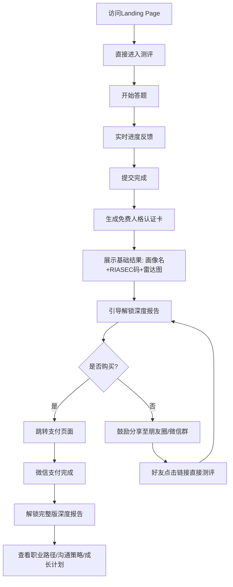

# 职业测评Web应用 产品需求文档 (PRD)

## 1. 文档概览

### 1.1 文档版本历史
| 版本 | 日期 | 修改人 | 变更说明 |
|------|------|--------|----------|
| V1.0 | 2026-07-11 | AI产品经理 | 初稿发布 |
| V1.1 | 2026-07-11 | AI产品经理 | 测评流程改为免登录，用户打开应用即可直接开始测试 |
| V1.2 | 2026-07-12 | AI产品经理 | 测评体系重构：弃用MBTI模型，改用IPIP大五人格+霍兰德RIASEC组合方案，规避商标侵权风险；新增三层人格标签体系与32种原型配置 |

### 1.2 项目背景与目标
为满足大学生与职场新人在职业方向选择、人际沟通适应、自我成长认知等方面的迫切需求，拟开发一款基于心理学理论的职业测评Web应用。通过科学的人格评估模型，帮助用户建立清晰的自我画像，并提供可落地的成长建议与发展路径。

项目核心目标包括：
- 实现"基础人格认证卡免费 + 深度分析报告付费"的商业化闭环
- 构建高信效度、强本土化适配的心理测评系统
- 打造具备社交传播属性的身份表达载体，提升用户裂变效率
- 在6个月内完成MVP上线并验证付费转化率≥8%

**测评体系合规声明：** 本项目采用 IPIP（国际人格题项池）大五人格量表与霍兰德 RIASEC 职业兴趣理论组合方案。IPIP 题项处于公有领域，可自由复制、翻译、商用；霍兰德理论框架可自由引用，题项均为自主编写。不使用 MBTI、INTJ 等注册商标或受版权保护的类型码，确保零法律风险。

### 1.3 核心商业模式（Freemium模式说明）
采用典型的Freemium分层服务模式：

**免费层：**
- 完成测评后立即获得三层人格标签：人格画像名（如"创意倡导者"）、RIASEC职业兴趣码（如"IAS"）、五维色彩光谱码、基础雷达图及简要生活建议
- 支持一键生成高清认证卡并分享至社交媒体
- 免费报告内容需具备足够获得感，确保用户愿意参与后续流程

**付费层：**
- 解锁深度报告，涵盖职业发展路径、跨人格协作指南、压力预警机制、个人成长行动计划等内容
- 定价2.99元人民币，符合Z世代消费能力与价值感知
- 报告内容应显著超越免费层信息密度，形成明确的价值阶梯

该模式已被心晴MBTI、16Personalities等头部平台验证有效，能显著降低参与门槛，同时通过高价值内容驱动转化。

## 2. 用户与场景分析

### 2.1 目标用户画像（聚焦大学生与职场新人）
| 维度 | 描述 |
|------|------|
| 年龄段 | 18–28岁 |
| 教育背景 | 本科及以上学历为主，部分高职院校学生 |
| 职业阶段 | 大二至大四在校生、应届毕业生、入职1–3年的职场新人 |
| 数字行为特征 | 高频使用微信生态、偏好移动端访问、热衷社交分享与身份标签表达 |
| 心理诉求 | 渴望被理解、寻求归属感、希望明确发展方向、缓解焦虑情绪 |
| 支付意愿 | 对单价低于100元的知识型产品有较强支付意愿，尤其当内容具有实用性与独特性时 |

### 2.2 核心痛点分析
| 序号 | 痛点类别 | 具体描述 | 来源依据 |
|------|--------|---------|----------|
| 1 | 职业方向迷茫 | 不清楚自己适合什么行业或岗位，缺乏科学的职业规划工具 | [五、发展趋势与产品设计启示] |
| 2 | 职场沟通障碍 | 无法有效与不同性格同事协作，常因误解引发冲突 | [五、发展趋势与产品设计启示] |
| 3 | 自我认知模糊 | 缺乏系统性的自我洞察，难以解释自身行为模式与情绪反应 | [五、发展趋势与产品设计启示] |
| 4 | 社交适应困难 | 进入新环境（如实习、换岗）后人际关系重建成本高 | [五、发展趋势与产品设计启示] |
| 5 | 成长路径缺失 | 缺少个性化的发展建议，不知道如何扬长避短进行提升 | [三、商业模式与定价策略分析] |
| 6 | 测评结果不可靠 | 市面多数平台信效度低，测试结果波动大，缺乏信任基础 | [一、核心发现与综合洞察] |
| 7 | 报告内容泛化 | 多数报告仅为通用性格描述，缺乏具体场景下的行动指引 | [三、商业模式与定价策略分析] |
| 8 | 缺乏身份认同载体 | 当前测评缺少可展示、可分享的身份符号，限制传播力 | [一、核心发现与综合洞察] |

### 2.3 竞品差异化策略（基于竞品调研报告提炼）
| 策略维度 | 主流做法 | 差异化机会点 | 支撑证据 |
|---------|--------|-------------|-----------|
| **理论严谨性** | 多数采用MBTI四维模型（受商标保护，存在法律风险） | 采用IPIP大五人格+霍兰德RIASEC组合，公有领域题项，零法律风险 | [二、主流测评理论体系与代表平台] |
| **本土化程度** | 泰斯特MBTI基于3129万中国用户数据优化常模 | 构建百万级中文语境专属题库与常模数据库，IPIP题项已有中文翻译 | [四、典型竞品深度剖析] |
| **技术先进性** | 少数平台使用AI动态算法调整题目难度 | 应用五维连续评分算法，提供比二分类型更精准的个性化画像 | [一、核心发现与综合洞察] |
| **内容深度** | 多数付费报告集中在职业匹配建议 | 提供覆盖职场、情感、社交、成长全维度的万字级解构主义报告 | [四、典型竞品深度剖析] |
| **用户体验** | 16Personalities以角色化命名和插画体系取胜 | 设计32种中文人格原型名+色彩光谱码，更具本土化传播力 | [五、发展趋势与产品设计启示] |
| **社交传播性** | 支持生成"INTJ-A-C"类人格卡片并分享（存在商标风险） | 生成自主设计的人格画像名+RIASEC码+色彩光谱认证卡，无侵权风险 | [一、核心发现与综合洞察] |
| **定价策略** | 行业主流价格带为29–99元人民币 | 设置2.99元普惠价格锚点，降低转化门槛，以量取胜 | [三、商业模式与定价策略分析] |

## 3. 产品架构

### 3.1 功能架构图（文字版功能映射）
```
┌────────────────────┐
│     用户端         │
├────────────────────┤
│ 4.1 测评前         │
│  - Landing Page    │
│  - 测评引导        │
├────────────────────┤
│ 4.2 测评中         │
│  - 动态答题界面    │
│  - 进度可视化      │
│  - 即时反馈机制    │
├────────────────────┤
│ 4.3 测评后         │
│  - 免费结果页      │
│  - 人格认证卡生成  │
│  - 一键分享功能    │
├────────────────────┤
│ 4.4 增值服务       │
│  - 深度报告预览    │
│  - 支付入口        │
│  - 报告详情页      │
├────────────────────┤
│ 4.5 个人中心       │
│  - 历史记录查看    │
│  - 账户设置        │
│  - 订单管理        │
└────────────────────┘

┌────────────────────┐
│     管理后台         │
├────────────────────┤
│ 4.6 后台管理系统   │
│  - 题库管理        │
│  - 订单管理        │
│  - 数据看板        │
│  - 用户行为分析    │
│  - 内容配置        │
└────────────────────┘
```

### 3.2 核心业务流程图（涵盖测评 → 免费结果卡片 → 付费转化 → 深度报告获取全流程）


## 4. 详细功能需求（核心部分）

### 4.1 用户端 - 测评前（Landing & Onboarding）

#### 功能名称：首页展示  
**优先级：P0**  
**用户故事：** 作为一个首次访问者，我希望看到清晰的产品价值主张和操作指引，以便决定是否参与测评  
**功能描述：**  
- 输入：无  
- 处理：加载Landing Page，展示Slogan、核心优势图标（如"96.5%复测一致性""万字级报告"）、CTA按钮、成功案例轮播  
- 输出：呈现包含产品定位、权威背书、操作引导的主视觉区域  
- 字段定义：slogan_text, feature_icons[], cta_button_text, testimonial_carousel[]  

**验收标准：**  
- 页面首屏加载时间≤2秒（4G网络下）  
- CTA按钮在首屏内可见且醒目  
- 移动端适配良好，无横向滚动条  
- 所有图片资源均启用懒加载  
- 无需注册或登录，用户打开应用即可直接开始测评  

---

#### 功能名称：测评前引导  
**优先级：P0**  
**用户故事：** 作为一个新手用户，我希望了解测评的意义和流程，减少心理负担  
**功能描述：**  
- 输入：用户点击"开始测试"按钮  
- 处理：展示引导弹窗，包含测评时长（约10分钟）、题目数量（80题）、科学背书说明（"基于IPIP大五人格量表与霍兰德RIASEC职业兴趣理论"）、五点李克特量表说明  
- 输出：用户可滑动查看说明页，最后点击"正式开始"进入答题环节  
- 字段定义：guide_steps[{title, content, image}], estimated_duration, question_count, theory_reference  

**验收标准：**  
- 引导页包含动画示意（如进度条演示）  
- 支持左右滑动手势切换页面  
- 提供"跳过引导"选项，但默认不勾选  
- 引导内容可在后台配置更新  

### 4.2 用户端 - 测评中（答题体验、进度反馈）

#### 功能名称：动态答题界面  
**优先级：P0**  
**用户故事：** 作为一个答题者，我希望界面简洁流畅，避免干扰注意力  
**功能描述：**  
- 输入：用户通过5点量表选择符合程度（1=非常不符合 ~ 5=非常符合）  
- 处理：单题全屏显示，每道题为陈述句+五点李克特量表选择；禁用浏览器返回键防止误触；记录作答时间戳  
- 输出：选择后自动切换至下一题，更新本地答题记录  
- 字段定义：question_id, statement_text, scale_value(1-5), response_timestamp  

**验收标准：**  
- 支持5点量表按钮选择，选中后350ms自动跳转下一题  
- 支持键盘1-5快捷键映射  
- 操作响应延迟<0.3秒  
- 屏幕亮度自动锁定，防止自动熄屏中断作答  
- 断网情况下允许继续答题，恢复连接后同步数据  
- 支持断点续测，本地缓存未提交的答题进度，重新打开应用可恢复至上次答题位置  

---

#### 功能名称：进度可视化  
**优先级：P0**  
**用户故事：** 作为一个关注进度的用户，我希望知道已完成多少题目  
**功能描述：**  
- 输入：当前题号、总题数、平均作答速度  
- 处理：计算完成百分比，估算剩余时间  
- 输出：底部显示线性进度条，实时更新（如"第34/80题"）  
- 字段定义：current_question_index, total_questions, progress_percentage, estimated_remaining_time  

**验收标准：**  
- 进度条颜色渐变提示（绿→黄→红）  
- 剩余时间估算误差≤±1分钟  
- 在低电量模式下仍保持动画流畅  
- 支持暂停/继续功能，累计中断时间不计入总耗时  

---

#### 功能名称：即时反馈机制  
**优先级：P0**  
**用户故事：** 作为一个希望获得激励的用户，我希望每次作答都有正向反馈  
**功能描述：**  
- 输入：用户完成一道题目的选择  
- 处理：触发微交互动画（如粒子飞散）并伴有轻微音效（可关闭）  
- 输出：视觉与听觉双重正向反馈，增强参与感  
- 字段定义：feedback_type(particle/sound), sound_enabled(default:true), animation_duration(0.5s)  

**验收标准：**  
- 动画持续时间≤0.5秒，不影响整体流畅性  
- 支持全局静音开关，记忆用户偏好  
- 在低端机型上自动降级动画效果  
- 音效文件体积≤50KB，采用Web Audio API播放  

### 4.3 用户端 - 测评后（结果页、免费卡片生成、裂变分享机制）

#### 功能名称：免费结果页  
**优先级：P0**  
**用户故事：** 作为一个刚完成测评的用户，我希望立即看到我的人格画像和基本解读  
**功能描述：**  
- 输入：用户提交全部答案  
- 处理：调用评分引擎计算大五人格五维度得分（O/C/E/A/N百分位），映射为32种人格原型之一，同时计算RIASEC六维度得分取前三生成职业兴趣码，生成五维雷达图  
- 输出：展示三层标签（人格画像名+RIASEC码+色彩光谱）、一句话总结、核心特质描述、社交建议模板  
- 字段定义：archetype_name, riasec_code, color_spectrum[{dimension, score, color}], summary_statement, core_traits[], social_tips[]  

**验收标准：**  
- 结果页加载时间≤1秒  
- 字体清晰可读，字号≥14px  
- 支持横向滑动查看更多维度解析  
- 显示"基于IPIP大五人格量表与霍兰德RIASEC理论综合推导"免责声明  

---

#### 功能名称：人格认证卡生成  
**优先级：P0**  
**用户故事：** 作为一个喜欢分享的用户，我希望拥有一张专属的身份卡片用于社交展示  
**功能描述：**  
- 输入：用户人格画像名、RIASEC码、色彩光谱、昵称（可编辑）、选择的主题模板  
- 处理：调用图像生成服务合成高清图片卡片  
- 输出：包含用户名字（可匿名）、人格画像名、RIASEC码、色彩光谱条、二维码（指向个人报告页）的PNG图片  
- 字段定义：card_template_id, user_nickname, archetype_name, riasec_code, color_spectrum, qr_code_url, export_resolution(1080p)  

**验收标准：**  
- 图片分辨率≥1080×1920像素  
- 支持保存至相册或下载到本地  
- 默认昵称为"匿名用户XX"格式  
- 二维码扫描后直达该用户的公开报告页  

---

#### 功能名称：裂变分享机制  
**优先级：P0**  
**用户故事：** 作为一个社交活跃用户，我希望轻松地将结果分享给朋友  
**功能描述：**  
- 输入：用户点击任一分享渠道按钮  
- 处理：调起微信SDK唤起对应分享面板；埋点记录分享事件  
- 输出：成功分享至微信好友、微信群、朋友圈、微博等主流渠道  
- 字段定义：share_channel(wechat_friend/group/moment/weibo), share_payload, referrer_id  

**验收标准：**  
- 分享成功率≥95%  
- 埋点追踪各渠道打开率与二次转化率  
- 分享链接附带邀请参数，实现来源追踪  
- 新用户通过链接进入并完成测评后，原分享者获得积分奖励  

### 4.4 用户端 - 增值服务（深度报告预览、支付流程、报告详情展示）

#### 功能名称：深度报告预览  
**优先级：P0**  
**用户故事：** 作为一个潜在付费用户，我想先了解报告内容再决定是否购买  
**功能描述：**  
- 输入：用户浏览免费结果页  
- 处理：截取深度报告部分内容作为预览（如深度职业专题章节前两段）  
- 输出：展示带遮罩的预览区域，"更多内容需解锁"提示  
- 字段定义：preview_content_snippet, masked_area_ratio(15%-20%), unlock_prompt_text  

**验收标准：**  
- 预览内容占全文比例在15%-20%之间  
- 排版美观易读，保留原文样式  
- 明确标注"以下内容需付费解锁"  
- 不暴露关键结论与独家方法论  

---

#### 功能名称：支付流程  
**优先级：P0**  
**用户故事：** 作为一个准备付费的用户，我希望支付流程简单安全  
**功能描述：**  
- 输入：用户点击"解锁完整报告"按钮  
- 处理：跳转至微信支付/支付宝H5页面；生成订单记录；接收支付回调  
- 输出：支付成功后自动跳转至报告详情页  
- 字段定义：product_id(report_full_access), price(2.99), payment_method(wechat_pay/alipay), order_status(pending/paid/failed)  

**验收标准：**  
- 支付成功率≥98%  
- 订单状态实时同步至前端  
- 支持优惠券抵扣功能（MVP阶段预留接口）  
- 提供清晰的退款政策说明入口  

---

#### 功能名称：报告详情展示  
**优先级：P0**  
**用户故事：** 作为一个已付费用户，我希望全面深入地理解自己的人格特质  
**功能描述：**  
- 输入：用户已支付成功的订单凭证  
- 处理：加载完整报告内容，包含职业路径规划、跨人格协作指南、压力预警机制、个人成长计划四大模块  
- 输出：图文混排的长页面，支持章节跳转、阅读进度记忆  
- 字段定义：report_sections[{title, content_html, illustration_url}], read_progress_percentage, last_read_timestamp  

**验收标准：**  
- 内容结构清晰，一级/二级标题分明  
- 图文比例合理，每千字至少配1张插图  
- 支持目录导航与锚点跳转  
- 阅读进度自动保存，支持多设备同步  

### 4.5 用户端 - 个人中心（历史记录查看、账户管理）

#### 功能名称：历史记录查看  
**优先级：P1**  
**用户故事：** 作为一个多次使用的用户，我想回顾之前的测评结果  
**功能描述：**  
- 输入：用户进入个人中心  
- 处理：查询用户历史测评记录  
- 输出：按时间倒序排列列表，点击可重新查看报告  
- 字段定义：test_history[{test_id, date, archetype_name, riasec_code, report_link, is_paid}]  

**验收标准：**  
- 最多保留3次完整报告记录  
- 支持删除旧记录释放空间  
- 删除操作需二次确认  
- 免费报告永久保留，付费报告在订阅期内可反复查看  

---

#### 功能名称：账户管理  
**优先级：P1**  
**用户故事：** 作为一个注重隐私的用户，我想管理我的个人信息  
**功能描述：**  
- 输入：用户修改昵称、头像、绑定手机等操作  
- 处理：更新用户档案，加密存储敏感信息  
- 输出：修改即时生效，前端同步刷新  
- 字段定义：user_profile{nickname, avatar_url, phone_bound, privacy_setting}  

**验收标准：**  
- 修改操作响应时间<1秒  
- 数据传输全程HTTPS加密  
- 提供"彻底删除账户"功能，执行后7日内清除所有关联数据  
- 隐私设置支持匿名化处理报告分享内容  

---

#### 功能名称：订单管理  
**优先级：P0**  
**用户故事：** 作为一个付费用户，我想查询我的购买记录  
**功能描述：**  
- 输入：用户进入订单中心  
- 处理：拉取所有支付订单数据  
- 输出：列表展示时间、金额、商品名称、状态（已完成/退款中）  
- 字段定义：order_list[{order_id, timestamp, amount, product_name, status, transaction_id}]  

**验收标准：**  
- 数据准确无误，与财务系统一致  
- 支持导出PDF账单用于报销  
- 退款申请流程清晰可见  
- 订单详情页显示电子发票申领入口  

### 4.6 管理后台（题库管理、订单管理、数据看板）

#### 功能名称：题库管理  
**优先级：P1**  
**用户故事：** 作为一个运营人员，我需要定期更新和维护测评题目  
**功能描述：**  
- 输入：新增/编辑/删除题目的操作指令  
- 处理：CRUD操作题库数据；支持批量导入导出；版本控制  
- 输出：题库列表更新，可用于发布新版测评  
- 字段定义：question_bank[{id, stem, scale_type(big_five/riasec), dimension(O/C/E/A/N/R/I/A/S/E/C), reverse_score(bool), status(active/inactive)}]  

**验收标准：**  
- 支持Excel模板批量导入导出  
- 每道题记录创建/修改日志  
- 支持灰度发布特定题组  
- 权限分级管理（管理员/编辑/只读）  

---

#### 功能名称：订单管理  
**优先级：P0**  
**用户故事：** 作为一个财务人员，我需要核对每一笔交易  
**功能描述：**  
- 输入：筛选条件（时间范围、订单状态、金额区间）  
- 处理：查询订单数据库，聚合统计数据  
- 输出：明细列表，支持导出CSV报表  
- 字段定义：admin_order_filter{date_range, status_filter, amount_min_max}, export_format(csv/pdf)  

**验收标准：**  
- 数据与前端展示完全一致  
- 更新延迟≤5分钟  
- 导出文件包含数字签名防篡改  
- 支持按商户订单号搜索  

---

#### 功能名称：数据看板  
**优先级：P1**  
**用户故事：** 作为一个产品经理，我需要监控关键业务指标  
**功能描述：**  
- 输入：自定义时间范围选择  
- 处理：聚合用户行为数据，生成可视化图表  
- 输出：展示日活、转化率、客单价、复购率、分享率等核心数据  
- 字段定义：dashboard_metrics{dau, completion_rate, conversion_rate, arpu, share_rate, retention_d7}  

**验收标准：**  
- 支持自定义时间范围（昨日/7日/30日/自定义）  
- 图表自动刷新频率为每小时一次  
- 关键指标异常波动时触发告警  
- 支持截图导出用于汇报  

---

#### 功能名称：内容配置  
**优先级：P1**  
**用户故事：** 作为一个内容编辑，我需要灵活调整报告模板  
**功能描述：**  
- 输入：修改报告标题、段落文本、推荐职位列表等操作  
- 处理：更新内容模板库，发布变更  
- 输出：前端报告内容实时更新，无需发版  
- 字段定义：content_templates{section_title, body_copy, job_recommendations[], call_to_action}  

**验收标准：**  
- 修改后实时生效，延迟<30秒  
- 支持A/B测试不同文案版本  
- 每次修改留痕，支持回滚至上一版本  
- 需经二级审批方可上线重大修改  

## 5. MVP 版本规划

### 5.1 MVP 核心验证目标
验证"基础人格认证卡免费 + 深度分析报告付费"模式的可行性，达成以下关键指标：
- 测评完成率 ≥ 70%
- 免费报告页停留时长 ≥ 90秒
- 付费转化率 ≥ 8%
- 社交分享率 ≥ 35%

### 5.2 MVP 功能范围清单（Must-have，必须包含核心测评流程与付费转化路径）
| 编号 | 模块 | 功能名称 | 优先级 | 是否MVP |
|-----|------|---------|--------|---------|
| 1 | 测评前 | 首页展示 | P0 | 是 |
| 2 | 测评前 | 测评前引导 | P0 | 是 |
| 3 | 测评中 | 动态答题界面 | P0 | 是 |
| 4 | 测评中 | 进度可视化 | P0 | 是 |
| 5 | 测评中 | 即时反馈机制 | P0 | 是 |
| 6 | 测评后 | 免费结果页 | P0 | 是 |
| 7 | 测评后 | 人格认证卡生成 | P0 | 是 |
| 8 | 测评后 | 一键分享功能 | P0 | 是 |
| 9 | 增值服务 | 深度报告预览 | P0 | 是 |
| 10 | 增值服务 | 支付入口 | P0 | 是 |
| 11 | 增值服务 | 报告详情页 | P0 | 是 |
| 12 | 个人中心 | 订单管理 | P0 | 是 |
| 13 | 管理后台 | 订单管理 | P0 | 是 |

### 5.3 后续迭代规划（V1.1, V1.2 阶段建议）
| 版本 | 时间节点 | 核心功能 | 目标 |
|------|----------|----------|------|
| V1.1 | 上线后第2个月 | - 历史记录查看<br>- 账户设置<br>- 题库管理后台<br>- 数据看板 | 提升用户留存率，完善运营管理能力 |
| V1.2 | 上线后第4个月 | - AI个性化报告生成<br>- 团队协作分析模块<br>- 企业定制版报价系统<br>- 题库本土化常模优化 | 拓展B端市场，提升ARPU值 |

## 6. 非功能性需求

### 6.1 数据安全与隐私保护（重点关注用户测评数据的存储与合规）
- 所有用户测评数据加密存储（AES-256）
- 严格遵守《个人信息保护法》，未经允许不得将数据用于第三方分析
- 默认匿名处理报告分享链接，禁止泄露真实姓名、学校等敏感信息
- 提供"彻底删除账户"功能，执行后7日内清除所有关联数据
- 用户答题原始数据仅用于本次测评，不纳入长期画像构建

### 6.2 性能要求（响应时间、并发支持等）
- Web页面首屏加载时间 ≤ 2秒（4G网络下）
- 测评答题操作响应延迟 < 0.3秒
- 支付接口可用性 ≥ 99.9%
- 系统支持并发用户数 ≥ 10,000
- API平均响应时间 < 500ms，P95 < 1.2s

### 6.3 埋点与数据统计需求（关键行为追踪）
| 事件类型 | 触发条件 | 上报字段 | 用途 |
|--------|----------|----------|------|
| 页面浏览 | 进入任意页面 | page_name, user_id, timestamp | 分析用户路径 |
| 开始测评 | 点击"开始测试"按钮 | start_time, device_type | 计算完成率 |
| 提交答案 | 每完成一道题 | question_id, scale_value, response_time | 优化题库质量 |
| 生成卡片 | 完成测评并生成认证卡 | archetype_name, riasec_code, share_enabled | 评估分享意愿 |
| 点击支付 | 点击"解锁完整报告"按钮 | report_type, preview_duration | 优化转化漏斗 |
| 支付成功 | 微信回调通知成功 | order_id, amount, payment_method | 统计收入与转化率 |
| 分享触发 | 点击任一分享按钮 | channel (wechat_friend/group/moment) | 评估裂变效果 |
| 报告阅读 | 滚动至报告底部 | report_id, read_duration | 计算内容吸引力指数 |

---

## 7. 测评体系设计（IPIP大五人格 + 霍兰德RIASEC）

### 7.1 理论基础与法律合规

#### 7.1.1 IPIP 大五人格量表
- **来源：** International Personality Item Pool（国际人格题项池），由 Lewis R. Goldberg 博士于1998年创建
- **版权状态：** 公有领域（Public Domain），可自由复制、编辑、翻译、商用，无需申请许可或支付费用
- **题项规模：** 3,320+题项，250+量表
- **采用量表：** IPIP-50（50题版，每个维度10题），已有中文翻译版本
- **五维度定义：**

| 维度 | 英文 | 高分特征 | 低分特征 | 对应MBTI维度（仅供参考） |
|------|------|---------|---------|----------------------|
| 开放性 | Openness (O) | 好奇、创造、求新 | 务实、传统、保守 | S/N（感觉/直觉） |
| 尽责性 | Conscientiousness (C) | 自律、计划、负责 | 灵活、随性、自发 | J/P（判断/感知） |
| 外向性 | Extraversion (E) | 热情、社交、活跃 | 内敛、安静、独处 | I/E（内倾/外倾） |
| 宜人性 | Agreeableness (A) | 亲和、合作、信任 | 独立、理性、竞争 | T/F（思考/情感） |
| 神经质 | Neuroticism (N) | 敏感、焦虑、情绪化 | 稳定、冷静、自信 | -（MBTI无对应维度） |

#### 7.1.2 霍兰德 RIASEC 职业兴趣理论
- **来源：** John L. Holland 的职业选择理论（理论框架已进入公有领域）
- **版权状态：** 理论可自由引用；SDS官方量表受PAR, Inc.版权保护，本项目**自主编写题项**，不使用SDS量表
- **六类型定义：**

| 类型 | 英文 | 核心特征 | 典型职业 |
|------|------|---------|---------|
| 现实型 | Realistic (R) | 喜欢动手操作、使用工具 | 工程师、技术员、运动员 |
| 研究型 | Investigative (I) | 喜欢分析、研究、解决复杂问题 | 科学家、分析师、医生 |
| 艺术型 | Artistic (A) | 喜欢创造、表达、审美设计 | 设计师、作家、音乐家 |
| 社会型 | Social (S) | 喜欢帮助、教导、服务他人 | 教师、咨询师、社工 |
| 企业型 | Enterprising (E) | 喜欢领导、说服、影响他人 | 管理者、销售、律师 |
| 常规型 | Conventional (C) | 喜欢组织、整理、处理数据 | 会计、行政、程序员 |

### 7.2 题项设计

#### 7.2.1 题项总量与结构
| 模块 | 题项数 | 维度/类型 | 每维度题数 | 计分方式 |
|------|--------|----------|-----------|---------|
| 大五人格（IPIP-50） | 50题 | O/C/E/A/N | 各10题 | 5点李克特量表，部分反向计分 |
| 职业兴趣（RIASEC-30） | 30题 | R/I/A/S/E/C | 各5题 | 5点李克特量表，正向计分 |
| **合计** | **80题** | **11个维度/类型** | - | - |

#### 7.2.2 量表说明
- **评分方式：** 5点李克特量表（1=非常不符合，2=比较不符合，3=不确定，4=比较符合，5=非常符合）
- **预计答题时间：** 约10分钟（平均每题7.5秒）
- **反向计分题：** 大五人格每个维度含2-3道反向计分题，用于检测作答一致性
- **题项示例：**

| 模块 | 维度 | 题项示例 | 计分方向 |
|------|------|---------|---------|
| 大五人格 | 开放性(O) | "我喜欢思考新的想法和可能性" | 正向 |
| 大五人格 | 开放性(O) | "我更倾向于按部就班而非尝试新方法" | 反向 |
| 大五人格 | 尽责性(C) | "我会提前制定计划并按计划执行" | 正向 |
| 大五人格 | 外向性(E) | "在社交场合中我通常是主动交谈的人" | 正向 |
| 大五人格 | 宜人性(A) | "即使意见不同，我也能理解对方的立场" | 正向 |
| 大五人格 | 神经质(N) | "我经常感到焦虑或不安" | 正向 |
| RIASEC | 现实型(R) | "我喜欢动手修理或组装物品" | 正向 |
| RIASEC | 研究型(I) | "我喜欢分析复杂数据寻找规律" | 正向 |
| RIASEC | 艺术型(A) | "我喜欢通过创意作品表达自我" | 正向 |
| RIASEC | 社会型(S) | "帮助他人成长让我感到充实" | 正向 |
| RIASEC | 企业型(E) | "我喜欢带领团队达成目标" | 正向 |
| RIASEC | 常规型(C) | "我喜欢整理信息让一切井井有条" | 正向 |

### 7.3 三层人格标签体系

#### 7.3.1 标签结构概览
用户完成测评后，系统生成三层标签，共同构成用户的人格身份标识：

| 层级 | 标签类型 | 生成逻辑 | 示例 | 数量 |
|------|---------|---------|------|------|
| 第一层 | RIASEC职业兴趣码 | 取六维度得分前三，按降序排列 | `IAS` | 120种组合 |
| 第二层 | 人格画像名 | 大五五维度高/低二分组合映射 | `创意倡导者` | 32种原型 |
| 第三层 | 色彩光谱码 | 五维度得分映射为渐变色点序列 | ●●●●● | 连续唯一 |

#### 7.3.2 色彩光谱设计
每个维度分配专属色，颜色深浅代表得分高低（1-5分对应5档色深）：

| 维度 | 专属色 | 色值 | 高分（深） | 低分（浅） |
|------|--------|------|-----------|-----------|
| 开放性(O) | 紫色系 | #9B7ED8 | #6B4EAB | #D4C3F0 |
| 尽责性(C) | 蓝色系 | #5a96b1 | #3A7691 | #B0D4E0 |
| 外向性(E) | 绿色系 | #5ea67e | #3E865E | #B0D5C0 |
| 宜人性(A) | 金色系 | #deb45c | #BE943C | #F0D9A0 |
| 稳定性(N↓) | 珊瑚色系 | #e17055 | #C15035 | #F0A590 |

### 7.4 32种人格原型配置表

大五人格五维度各分为高(H)/低(L)两档，组合产生 2^5 = 32 种原型。以下为完整配置表：

#### 7.4.1 高开放性组（O↑，共16种）

| 编号 | 维度组合 | 画像名 | 一句话描述 | 稀有度 | 典型职业方向 |
|------|---------|--------|-----------|--------|-------------|
| 01 | O↑C↑E↑A↑N↓ | 创意倡导者 | 充满灵感且善于落地的领导者 | 稀有 | 产品总监、创业CEO |
| 02 | O↑C↑E↑A↑N↑ | 共情先锋 | 敏锐感知他人需求的开拓者 | 极稀有 | 用户体验研究、心理咨询 |
| 03 | O↑C↑E↑A↓N↓ | 自信开拓者 | 目标明确的创新执行者 | 常见 | 市场总监、投资经理 |
| 04 | O↑C↑E↑A↓N↑ | 锐意进取者 | 追求卓越的竞争型创新者 | 常见 | 管理咨询、投行分析师 |
| 05 | O↑C↑E↓A↑N↓ | 沉稳架构师 | 深思熟虑的系统设计者 | 稀有 | 系统架构师、战略规划 |
| 06 | O↑C↑E↓A↑N↑ | 深思关怀者 | 细腻负责的知识工作者 | 常见 | 学术研究、医疗诊断 |
| 07 | O↑C↑E↓A↓N↓ | 独立工程师 | 专注高效的独立问题解决者 | 常见 | 软件工程师、数据科学家 |
| 08 | O↑C↑E↓A↓N↑ | 完美探索者 | 追求极致的深度思考者 | 稀有 | 科研学者、精算师 |
| 09 | O↑C↓E↑A↑N↓ | 灵感传播者 | 活力四射的创意传播人 | 常见 | 品牌策划、内容创作 |
| 10 | O↑C↓E↑A↑N↑ | 热情联结者 | 感性丰富的社交达人 | 常见 | 公关、社群运营 |
| 11 | O↑C↓E↑A↓N↓ | 自由探索者 | 不受拘束的冒险家 | 常见 | 旅行博主、创业者 |
| 12 | O↑C↓E↑A↓N↑ | 冒险创新者 | 充满激情的冒险创新者 | 稀有 | 风险投资、极限运动 |
| 13 | O↑C↓E↓A↑N↓ | 随性梦想家 | 温和自由的灵魂探索者 | 常见 | 自由撰稿人、艺术家 |
| 14 | O↑C↓E↓A↑N↑ | 敏感艺术家 | 情感细腻的创意表达者 | 稀有 | 诗人、音乐人、插画师 |
| 15 | O↑C↓E↓A↓N↓ | 独立思考者 | 冷静超然的自由思想者 | 常见 | 独立学者、自由职业 |
| 16 | O↑C↓E↓A↓N↑ | 叛逆创作者 | 不羁的独立创意人 | 稀有 | 先锋艺术家、独立导演 |

#### 7.4.2 务实型组（O↓，共16种）

| 编号 | 维度组合 | 画像名 | 一句话描述 | 稀有度 | 典型职业方向 |
|------|---------|--------|-----------|--------|-------------|
| 17 | O↓C↑E↑A↑N↓ | 稳健协调者 | 务实可靠的团队凝聚者 | 常见 | 项目经理、HR总监 |
| 18 | O↓C↑E↑A↑N↑ | 温暖守护者 | 细心负责的关怀者 | 常见 | 护理管理、教育培训 |
| 19 | O↓C↑E↑A↓N↓ | 果断执行者 | 高效直接的行动派 | 常见 | 运营总监、销售管理 |
| 20 | O↓C↑E↑A↓N↑ | 务实竞争者 | 结果导向的务实竞争者 | 常见 | 房地产、快消品管理 |
| 21 | O↓C↑E↓A↑N↓ | 可靠支持者 | 踏实可靠的幕后支柱 | 常见 | 财务会计、行政管理 |
| 22 | O↓C↑E↓A↑N↑ | 忠诚守卫者 | 尽职尽责的守护者 | 常见 | 品质管理、安全审核 |
| 23 | O↓C↑E↓A↓N↓ | 冷静分析者 | 理性客观的问题解决者 | 常见 | 数据分析、工程管理 |
| 24 | O↓C↑E↓A↓N↑ | 严谨审查者 | 一丝不苟的质检专家 | 稀有 | 审计师、法务合规 |
| 25 | O↓C↓E↑A↑N↓ | 活跃助人者 | 热心肠的行动派 | 常见 | 社区服务、活动策划 |
| 26 | O↓C↓E↑A↑N↑ | 热心社交者 | 感性热心的社交爱好者 | 常见 | 客户服务、社团组织 |
| 27 | O↓C↓E↑A↓N↓ | 自在行动者 | 随性直接的行动者 | 常见 | 自由销售、个体经营 |
| 28 | O↓C↓E↑A↓N↑ | 冲动冒险者 | 敢想敢冲的冒险者 | 稀有 | 创业者、交易员 |
| 29 | O↓C↓E↓A↑N↓ | 轻松陪伴者 | 随和温暖的陪伴者 | 常见 | 客户关系、后勤保障 |
| 30 | O↓C↓E↓A↑N↑ | 友善观察者 | 安静友善的观察者 | 常见 | 图书馆员、档案管理 |
| 31 | O↓C↓E↓A↓N↓ | 洒脱自由人 | 随遇而安的自由灵魂 | 常见 | 自由职业、gap year |
| 32 | O↓C↓E↓A↓N↑ | 随性体验者 | 感性随性的体验主义者 | 稀有 | 生活类博主、体验师 |

#### 7.4.3 原型配置字段定义
每个原型在数据库中包含以下字段：

| 字段名 | 类型 | 说明 | 示例 |
|--------|------|------|------|
| archetype_id | int | 原型编号(1-32) | 1 |
| archetype_code | string | 维度组合码 | OHCHEHAEHLN |
| archetype_name | string | 中文画像名 | 创意倡导者 |
| archetype_slogan | string | 一句话描述 | 充满灵感且善于落地的领导者 |
| rarity | string | 稀有度标签 | 稀有 |
| rarity_percentage | float | 人口占比 | 3.2% |
| famous_people | json | 同型名人列表 | ["史蒂夫·乔布斯", "埃隆·马斯克"] |
| best_partners | json | 最佳协作原型ID列表 | [5, 17, 23] |
| career_directions | json | 推荐职业方向 | ["产品总监", "创业CEO", "设计思维顾问"] |
| o_range | string | 开放性区间 | high |
| c_range | string | 尽责性区间 | high |
| e_range | string | 外向性区间 | high |
| a_range | string | 宜人性区间 | high |
| n_range | string | 神经质区间 | low |
| mascot_url | string | 吉祥物图片路径 | /assets/images/mascots/01.png |

### 7.5 评分算法

#### 7.5.1 大五人格评分流程
```
1. 收集50道大五题项的原始作答（1-5分）
2. 对反向计分题进行翻转（1↔5, 2↔4, 3↔3）
3. 计算每个维度的总分（10题之和，范围10-50）
4. 转换为百分位数（基于常模数据）
5. 以中位数(50百分位)为界划分高(H)/低(L)两档
6. 将五维度高低组合映射到32种原型之一
```

#### 7.5.2 RIASEC评分流程
```
1. 收集30道RIASEC题项的原始作答（1-5分）
2. 计算每个类型的总分（5题之和，范围5-25）
3. 按总分降序排列六个类型
4. 取前三名生成三字母职业兴趣码（如IAS）
5. 前三名中如有并列分，按RIASEC字母顺序优先
```

#### 7.5.3 综合标签生成
```
输入：大五五维度百分位分数 + RIASEC六维度总分
处理：
  1. 大五分数 → 高低二分 → 匹配32原型表 → 获取画像名
  2. RIASEC分数 → 降序排列 → 取前三 → 生成兴趣码
  3. 大五分数 → 映射色彩 → 生成色彩光谱码
输出：{ archetype_name, riasec_code, color_spectrum, o_score, c_score, e_score, a_score, n_score }
```

### 7.6 深度报告章节结构（12章）

| 章节 | 标题 | 内容说明 |
|------|------|---------|
| 1 | 你的人格画像 | 展示画像名、RIASEC码、色彩光谱、五维度百分位 |
| 2 | 人格特征分析 | 五维度逐一解读，高分/低分行为表现 |
| 3 | 人口比例 | 该原型在人群中的占比，与相邻原型的差异 |
| 4 | 相同人格名人 | 同原型知名人物列表及共同特质 |
| 5 | 人格优势 | 五维度组合带来的核心优势 |
| 6 | 人格劣势 | 潜在盲点与需注意的短板 |
| 7 | 成长建议 | 针对性发展路径与具体行动建议 |
| 8 | 大五人格五维度深度解读 | 每维度展开：认知模式、情绪反应、行为偏好 |
| 9 | 人格恋爱专题 | 该原型在亲密关系中的表现模式 |
| 10 | 最佳恋爱对象 | 与其他原型的兼容性矩阵与推荐搭配 |
| 11 | 深度职业专题 | 结合RIASEC码的职业路径规划与行业分析 |
| 12 | 合适的职业 | 基于原型+RIASEC的推荐职业列表与岗位匹配 |

### 7.7 与原MBTI方案对比

| 对比维度 | 原方案（MBTI） | 新方案（IPIP+RIASEC） |
|---------|--------------|---------------------|
| 理论基础 | MBTI四维模型 | 大五人格五维模型 + 霍兰德六维模型 |
| 法律风险 | 高（MBTI商标侵权） | 零（公有领域+自主编写） |
| 题项数量 | 60题（二分强制选择） | 80题（5点李克特量表） |
| 评分方式 | 二分法（E/I, S/N, T/F, J/P） | 连续分数（百分位） |
| 标签格式 | INTJ-A-C | 创意倡导者·IAS + 色彩光谱 |
| 类型数量 | 16种×2变体=32 | 32原型×120兴趣码=3840种组合 |
| 职业关联 | 弱（需额外解读） | 强（RIASEC本身即职业兴趣码） |
| 个性化程度 | 低（百万人同标签） | 高（连续分数+三字母组合） |
| 量表来源 | 自编（无科学验证） | IPIP-50（公有领域，有信效度数据） |
| 深度报告第8章 | 荣格八维专项解读 | 大五人格五维度深度解读 |
| 定价 | 2.99元 | 2.99元（不变） |
| 答题时长 | ~12分钟 | ~10分钟 |
